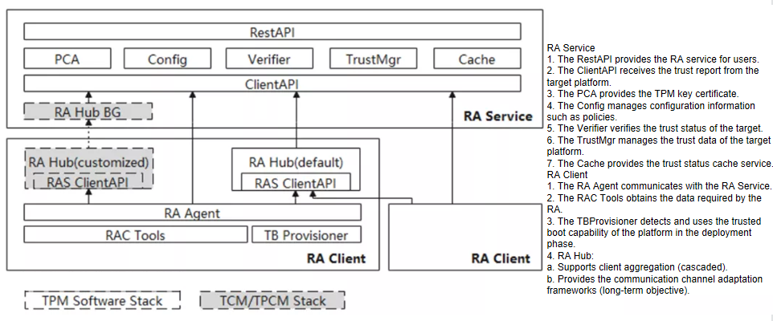

# Kunpeng Security Libraries (kunpengsecl)

## Description
This project develops basic security software components running on Kunpeng processors. In the early stage, the project focuses on trusted computing fields such as remote attestation to empower security developers in the community.

## Software Architecture


### Minimal realization
Users can write their own TEE Attester based on the TEE Verifier Lib and QCA Lib (released by Huawei) to verify the integrity of the user TA in the TEE, using the TEE self generated AK.


### Independent realization
Users can write their own TEE Attester based on the TEE Verifier Lib and QCA Lib (released by Huawei) to verify the integrity of the user TA in the TEE, using the TEE AK Service to generate AK.

**NO_DAA scenario**


**WITH_DAA scenario**


### Integrated realization
Users can use the TEE/TA remote attestation capabilities integrated into the existing remote attestation framework of the security libraries to verify the integrity of the user TA in the TEE.


## Getting Started
### Installation based on openEuler system
The openEuler system can use **RPM** method to install this program. 
First, you can execute the following command to obtain the latest source code.
```shell
git clone https://gitee.com/openeuler/kunpengsecl.git
```

And then enter the *kunpengsecl/* directory and execute command `make rpm`, so that you can generate the RPM package of this program.

After completing the production of the rpm package, please enter the directory **rpmbuild/RPMS/x86_64(aarch64)** under the parent directory of kunpengsecl directory to install the rpm package you need.
```shell
$ rpm -ivh kunpengsecl-ras-2.0.0-1.x86_64(aarch64).rpm
```

If you no longer need this program in the future, you can also uninstall it using the following command.
```shell
$ rpm -e kunpengsecl-ras-2.0.0-1.x86_64(aarch64)
```

If you want to compile the source code, you need install some libraries as following:
```shell
$ sudo yum install openssl-devel crypto-devel cjson-devel cjson
```

### Installation based on Ubuntu system
The Ubuntu system does not support rpm installation, but we still provide you with a choice.

After cloning the project source code, for the installation of the server RAS and client RAC, enter the directory **kunpengsecl/attestation/ras** and **kunpengsecl/attestation/rac** respectively, execute the `make install` command to automatically compile the program and install the corresponding files to the default location.

In addition, it is also supported to execute `make install` in the kunpengsecl root directory while installing all programs.

If you need to customize the installation directory, you can use either of the following commands.
```shell
$ make DESTDIR=/xxx/xxx install
$ make install DESTDIR=/xxx/xxx
```

For the uninstallation of server RAS and client RAC, enter the **kunpengsecl/attestation/ras** and **kunpengsecl/attestation/rac** directories respectively and execute the `make uninstall` command to automatically clean up the installed files.

If you need to specify a file directory, you can choose either of the following uninstall instruction formats.
```shell
$ make DESTDIR=/xxx/xxx uninstall
$ make uninstall DESTDIR=/xxx/xxx
```

If you want to compile the source code, you need install some libraries as following:
```shell
$ sudo apt-get install build-essential openssl openssl-dev libssl-dev libcjson-dev
```

## Compilation
golang: >= 1.17.x

TA code: ARM GCC supported by ARM server

other C code: normal GCC in openEuler/Ubuntu distribution package

## Instruction for use
### Software configuration
To ensure the normal operation of the program, it is necessary to prepare the correct database environment. This requires you to first enter the **usr/share/attestation/ras** directory, and then execute the **prepare-database-env.sh** shell script to automate the database environment configuration.

By default, the configuration file on which the program runs has three paths: the current directory "./config.yaml", the HOME directory "${HOME}/.config/attestation/ras(rac)(rahub)(qcaserver)(attester)(tas)/config.yaml", and the system directory "/etc/attestation/ras(rac)(rahub)(qcaserver)(attester)(tas)/config.yaml".

In order to create the home directory configuration file, you can execute the script  **prepare-ras(rac)(hub)(qca)(attester)(tas)conf-env.sh** under **usr/share/attestation/ras(rac)(rahub)(qcaserver)(attractor)(tas)** after installing the RPM packages. This automatically completes the deployment of the home directory configuration file

### RAS startup parameters
Executing `ras` that you can start server. In the RAS directory, you need to provide a `ECDSA` public key and name it `ecdsakey.pub`. 
The relevant parameters are as follows.
```
  -H  --https         http/https switch，default is https(true), false=http
  -h  --hport         restful API port for RAS to listen in https mode
  -p, --port string   this app service listen at [IP]:PORT
  -r, --rest string   this app rest interface listen at [IP]:PORT
  -T, --token         generate test token and quit
  -v, --verbose       show more detail running information
  -V, --version       show version number and quit
```

### RAC startup parameters
Executing `sudo raagent` that you can start client. Please note that sudo permission is required to enable the physical TPM module. 
The relevant parameters are as follows.
```
  -s, --server string   connect attestation server at IP:PORT
  -t, --test            run in test mode[true] or not[false/default]
  -v, --verbose         show more detail running information
  -V, --version         show version number and quit
  -i, --imalog          specify the ima file path
  -b, --bioslog         specify the bios file path
  -T, --tatest          true=start in TA test mod, false=start in normal mode
```

### Minimal realization
#### QCA startup parameters
Enter `${DESTDIR}/usr/bin/qcaserver` on the command line to start the QCA program, please note that the full path of qcaserver must be used to start QTA normally, and the CA path parameter in QTA needs to be kept the same as the path.
The relevant parameters are as follows:
```
  -C, --scenario int    set the application scenario of the program
  -S, --server string   specify an open server address/port
```

#### ATTESTER startup parameters
Enter `attester` on the command line to start ATTESTER program.
The relevant parameters are as follows:
```
  -B, --basevalue string   set the base value file read path
  -M, --mspolicy int       set the measurement strategy (1 is to compare only img-hash values, 2 is to compare only hash values, and 3 is to compare both img-hash and hash values at the same time)
  -S, --server string      specify the address of the server to connect to
  -U, --uuid int           specify the trusted apps to verify
  -V, --version            print the program version and exit
  -T, --test               read fixed nonce values to match currently hard-coded trusted reports
```

### Independent realization

#### No-DAA scenario
**Enable the server-side AK_Service for attestation keys**

Type `tas` on the command line to start AK_Service program. 
The relevant parameters are as follows:
```
  -T, --token         generate a verification code for testing and exit
```

**Enable QCA for the server**
ENTER `${DESTDIR}/usr/bin/qcaserver -C 1` at the command line to start QCA.

**Enable ATTESTER**

same as <a href="#Instruction for use">Minimal realization</a>。

>notes: In a AK_Service environment, in order to improve the efficiency of QCA configuration certificate, not every boot needs to access the AK_Service to generate the corresponding certificate, but through the localized storage of the certificate, that is, read the certification path configured in `config.yaml` on the QCA side, check whether a AK_Service-issued certificate has been saved locally through the `func hasAKCert(s int) bool` function, and if the certificate is successfully read, AK_Service If the certificate cannot be read, you need to access the AK_Service and save the certificate returned by the AK_Service locally.

#### DAA scenario
**Enable the server-side AK_Service for attestation keys**

To enable the AKS service, you must configure the private key for AKS. Run the following command to modify the configuration file in the home directory:
```bash
$ cd ${HOME}/.config/attestation/tas
$ vim config.yaml
 # The values of the following DAA_GRP_KEY_SK_X and DAA_GRP_KEY_SK_Y are for testing purposes only.
 # Be sure to update their contents to ensure safety before normal use.
tasconfig:
  port: 127.0.0.1:40008
  rest: 127.0.0.1:40009
  akskeycertfile: ./ascert.crt
  aksprivkeyfile: ./aspriv.key
  huaweiitcafile: ./Huawei IT Product CA.pem
  DAA_GRP_KEY_SK_X: 65A9BF91AC8832379FF04DD2C6DEF16D48A56BE244F6E19274E97881A776543C
  DAA_GRP_KEY_SK_Y: 126F74258BB0CECA2AE7522C51825F980549EC1EF24F81D189D17E38F1773B56
```
Then enter `tas` to start AK_Service program.

**Enable QCA for the server**
The command line enters `${DESTDIR}/usr/bin/qcaserver -C 2` to start QCA.

**Enable ATTESTER**

same as <a href="#Instruction for use">Minimal realization</a>。

>notes: In a AK_Service environment, in order to improve the efficiency of QCA configuration certificate, not every boot needs to access the AK_Service to generate the corresponding certificate, but through the localized storage of the certificate, that is, read the certification path configured in `config.yaml` on the QCA side, check whether a AK_Service-issued certificate has been saved locally through the `func hasAKCert(s int) bool` function, and if the certificate is successfully read, AK_Service If the certificate cannot be read, you need to access the AK_Service and save the certificate returned by the AK_Service locally.

Currently, on the AKS side, the following interfaces are provided to support remote control by administrators:
```
/config: GET
/config: POST
```

If the administrator needs to query the configuration information on the AKS side, you can use the GET method of the `/config` interface:
```s
curl -X GET -H "Content-Type: application/json" http://localhost:40009/config
```
***
If the administrator needs to modify the configuration information of the AKS side, you can use the POST method of the `/config` interface:
```s
curl -X POST -H "Content-Type: application/json" -H "Authorization: $AUTHTOKEN" -d '{"basevalue":"testvalue"}' http://localhost:40009/config
```
>notes: Currently, only the benchmark value is supported for reading and modifying configuration information on the AKS side

### Integrated realization
Users can verify the integrity of user TAs in TEE using the TEE/TA remote attestation capability integrated in the existing remote attestation framework of the security library.

### Interface definition
In order to facilitate the administrator to manage the target server, RAS and the user TA in the TEE deployed on the target server, this program designs the following interfaces for calling:
```
/: GET
/{id}: GET、POST、DELETE
/{from}/{to}: GET
/{id}/reports: GET
/{id}/reports/{reportid}: GET、DELETE
/{id}/basevalues: GET
/{id}/newbasevalue: POST
/{id}/basevalues/{basevalueid}: GET、POST、DELETE
/{id}/ta/{tauuid}/status: GET
/{id}/ta/{tauuid}/tabasevalues: GET
/{id}/ta/{tauuid}/tabasevalues/{tabasevalueid}: GET、POST、DELETE
/{id}/ta/{tauuid}/newtabasevalue: POST
/{id}/ta/{tauuid}/tareports: GET
/{id}/ta/{tauuid}/tareports/{tareportid}: GET、DELETE
/version: GET
/login: GET
/config: GET、POST
/{id}/container/status: GET
/{id}/device/status: GET
```
Next, the specific usage of the above interfaces is introduced.
***
If you want to query information for all servers, you can use the `"/"` interface.
```shell
$ curl -X GET -H "Content-Type: application/json" http://localhost:40002/
```
***
If you want to query the details of the target server, you can use the `GET` method of the `"/{id}"` interface, where {id} is the unique identification number assigned by RAS to the target server.
```shell
$ curl -X GET -H "Content-Type: application/json" http://localhost:40002/1
```
***
If you want to modify the information of the target server, you can use the `POST` method of the `"/{id}"` interface, where $AUTHTOKEN is the authentication code that you automatically generated using `ras -T` beforehand.
```go
type clientInfo struct {
	Registered   *bool `json:"registered"`  // target server registration status
	IsAutoUpdate *bool `json:"isautoupdate"`// target server baseline update policy
}
```
```shell
$ curl -X POST -H "Authorization: $AUTHTOKEN" -H "Content-Type: application/json" http://localhost:40002/1 -d '{"registered":false, "isautoupdate":false}'
```
***
If you want to delete the target server, you can use the `DELETE` method of the `"/{id}"` interface, note that instead of deleting all information about the target server, you can set the registration status of the target server to `false`!
```shell
$ curl -X DELETE -H "Authorization: $AUTHTOKEN" -H "Content-Type: application/json" http://localhost:40002/1
```
***
If you want to query all server information in a specified range, you can use the `GET` method of the `"/{from}/{to}"` interface.
```shell
$ curl -X GET -H "Content-Type: application/json" http://localhost:40002/1/9
```
***
If you want to query all trusted reports of the target server, you can use the `GET` method of the `"/{id}/reports"` interface.
```shell
$ curl -X GET -H "Content-Type: application/json" http://localhost:40002/1/reports
```
***
If you want to query the details of a trusted report specified by the target server, you can use the `GET` method of the `"/{id}/reports/{reportid}"` interface, where {reportid} is the unique identification number assigned by RAS to the trusted report specified by the target server.
```shell
$ curl -X GET -H "Content-Type: application/json" http://localhost:40002/1/reports/1
```
***
If you want to delete the target server specified trusted report, you can use the `DELETE` method of the `"/{id}/reports/{reportid}"` interface, note that using this method will delete all information about the specified trusted report, and you will no longer be able to query the report through the interface!
```shell
$ curl -X DELETE -H "Authorization: $AUTHTOKEN" -H "Content-Type: application/json" http://localhost:40002/1/reports/1
```
***
If you want to query all baseline values of the target server, you can use the `GET` method of the `"/{id}/basevalues"` interface.
```shell
$ curl -X GET -H "Content-Type: application/json" http://localhost:40002/1/basevalues
```
***
If you want to add a baseline value to the target server, you can use the `POST` method of the `"/{id}/newbasevalue"` interface.
```go
type baseValueJson struct {
	BaseType   string `json:"basetype"`   // base value type
	Uuid       string `json:"uuid"`       // the identification number of the container or device
	Name       string `json:"name"`       // base value name
	Enabled    bool   `json:"enabled"`    // whether a baseline value is available
	Pcr        string `json:"pcr"`        // PCR value
	Bios       string `json:"bios"`       // BIOS value
	Ima        string `json:"ima"`        // IMA value
	IsNewGroup bool   `json:"isnewgroup"` // whether it is a new set of baseline values
}
```
```shell
$ curl -X POST -H "Authorization: $AUTHTOKEN" -H "Content-Type: application/json" http://localhost:40002/1/newbasevalue -d '{"name":"test", "basetype":"host", "enabled":true, "pcr":"testpcr", "bios":"testbios", "ima":"testima", "isnewgroup":true}'
```
***
If you want to query the details of the base value specified by the target server, you can use the `GET` method of the `"/{id}/basevalues/{basevalueid}"` interface, where {basevalueid} is the unique identification number assigned by RAS to the specified base value of the target server.
```shell
$ curl -X GET -H "Content-Type: application/json" http://localhost:40002/1/basevalues/1
```
***
If you want to modify the available state of the target server's specified base value, you can use the `POST` method of the `"/{id}/basevalues/{basevalueid}"` interface.
```shell
$ curl -X POST -H "Content-type: application/json" -H "Authorization: $AUTHTOKEN" http://localhost:40002/1/basevalues/1 -d '{"enabled":true}'
```
***
If you want to delete the specified baseline value of the target server, you can use the `DELETE` method of the `"/{id}/basevalues/{basevalueid}"` interface, note that using this method will delete all information about the specified base value, and you will no longer be able to query the base value through the interface!
```shell
$ curl -X DELETE -H "Authorization: $AUTHTOKEN" -H "Content-Type: application/json" http://localhost:40002/1/basevalues/1
```
***

If you want to query the trusted status of a specific user TA on the target server, you can use the GET method of the `"/{id}/ta/{tauuid}/status"` interface. where $AUTHTOKEN is the authentication code automatically generated by you using `ras -T` in advance, {id} is the unique identification number assigned by RAS to the target server, and {tauuid} is the identification number of the specific user TA.

```bash
$ curl -k -X GET -H "Content-type: application/json" -H "Authorization: $AUTHTOKEN" https://localhost:40003/{id}/ta/{tauuid}/status
```
***
If you want to query all the baseline value information of a specific user TA on the target server, you can use the GET method of the `"/{id}/ta/{tauuid}/tabasevalues"` interface.

```bash
$ curl -k -X GET -H "Content-type: application/json" https://localhost:40003/{id}/ta/{tauuid}/tabasevalues
```
***
If you want to query the details of a specified base value for a specific user TA on the target server, you can use the GET method of the `"/{id}/ta/{tauuid}/tabasevalues/{tabasevalueid}"` interface. where {tabasevalueid} is the unique identification number assigned by RAS to the specified base value of a specific user TA on the target server.

```bash
$ curl -k -X GET -H "Content-type: application/json" https://localhost:40003/{id}/ta/{tauuid}/tabasevalues{tabasevalueid}
```
***
If you want to modify the available status of a specified base value for a specific user TA on the target server, you can use the `POST` method of the `"/{id}/ta/{tauuid}/tabasevalues/{tabasevalueid}"` interface.

```bash
$ curl -k -X POST -H "Content-type: application/json" -H "Authorization: $AUTHTOKEN"  https://localhost:40003/{id}/ta/{tauuid}/tabasevalues/{tabasevalueid} --data '{"enabled":true}'
```
***
If you want to delete the specified base value of a specific user TA on the target server, you can use the `DELETE` method of the `"/{id}/ta/{tauuid}/tabasevalues/{tabasevalueid}"` interface, note that using this method will delete all information about the specified base value, and you will no longer be able to query the base value through the interface!
```bash
$ curl -X DELETE -H "Content-type: application/json" -H "Authorization: $AUTHTOKEN" -k http://localhost:40003/{id}/ta/{tauuid}/tabasevalues/{tabasevalueid}
```
***
If you want to add a baseline value to a specific user TA on the target server, you can use the `POST` method of the `"/{id}/ta/{tauuid}/newtabasevalue"` interface.
```go
type tabaseValueJson struct {
	Uuid      string `json:"uuid"`       // the identification number of the user TA
	Name      string `json:"name"`       // base value name
	Enabled   bool   `json:"enabled"`    // whether a baseline value is available
	Valueinfo string `json:"valueinfo"`  // mirror hash value and memory hash value
}
```
```bash
$ curl -X POST -H "Content-Type: application/json" -H "Authorization: $AUTHTOKEN" -k https://localhost:40003/24/ta/test/newtabasevalue -d '{"uuid":"test", "name":"testname", "enabled":true, "valueinfo":"test info"}'
```
***
If you want to query the target server for all trusted reports for a specific user TA, you can use the `GET` method of the `"/{id}/ta/{tauuid}/tareports"` interface.
```bash
$ curl -k -X GET -H "Content-type: application/json" https://localhost:40003/28/ta/test/tareports
```
***
If you want to query the details of a specified trusted report for a specific user TA on the target server, you can use the `GET` method of the `"/{id}/ta/{tauuid}/tareports/{tareportid}"` interface, where {tareportid} is the unique identification number assigned by RAS to the specified trusted report of a specific user TA on the target server.
```bash
$ curl -k -X GET -H "Content-type: application/json" https://localhost:40003/28/ta/test/tareports/2
```
***
If you want to delete the specified trusted report of a specific user TA on the target server, you can use the `DELETE` method of the `"/{id}/ta/{tauuid}/tareports/{tareportid}"` interface, note that using this method will delete all information of the specified trusted report, and you will no longer be able to query the report through the interface!
```bash
$ curl -X DELETE -H "Content-type: application/json" http://localhost:40003/28/ta/test/tareports/2
```
***
If you want to get the version information of the program, you can use the `GET` method of the `"/version"` interface.
```shell
$ curl -X GET -H "Content-Type: application/json" http://localhost:40002/version
```
***
If you want to query the configuration information of the target server/RAS/database, you can use the `GET` method of the `"/config"` interface.
```shell
$ curl -X GET -H "Content-Type: application/json" http://localhost:40002/config
```
***
If you want to modify the configuration information of the target server/RAS/database, you can use the `POST` method of the `"/config"` interface.
```go
type cfgRecord struct {
  // target server configuration
	HBDuration      string `json:"hbduration" form:"hbduration"`
	TrustDuration   string `json:"trustduration" form:"trustduration"`
  	DigestAlgorithm string `json:"digestalgorithm" form:"digestalgorithm"`
  // database configuration
	DBHost          string `json:"dbhost" form:"dbhost"`
	DBName          string `json:"dbname" form:"dbname"`
	DBPassword      string `json:"dbpassword" form:"dbpassword"`
	DBPort          int    `json:"dbport" form:"dbport"`
	DBUser          string `json:"dbuser" form:"dbuser"`
  // RAS configuration
	MgrStrategy     string `json:"mgrstrategy" form:"mgrstrategy"`
	ExtractRules    string `json:"extractrules" form:"extractrules"`
  	IsAllupdate     *bool  `json:"isallupdate" form:"isallupdate"`
	LogTestMode     *bool  `json:"logtestmode" form:"logtestmode"`
}
```
```shell
$ curl -X POST -H "Authorization: $AUTHTOKEN" -H "Content-Type: application/json" http://localhost:40002/config -d '{"hbduration":"5s","trustduration":"20s","DigestAlgorithm":"sha256"}'
```

## FAQ
1. Why do I get an error when RPM packing?

>Because the automatic compilation of the program will be completed before the actual rpm packaging, which depends on multiple package tools, if you have compilation errors, you can try to execute the **prepare-build-env.sh** script in the **kunpengsecl/attestation/quick-scripts** directory to prepare the necessary compilation environment.
```shell
$ bash ./attestation/quick-scripts/prepare-build-env.sh
```

2. Why is it inaccessible through RESTAPI after RAS is launched?

>Because RAS is started in HTTPS mode by default, you need to provide a valid certificate to RAS to access normally, while RAS started in HTTP mode does not need to provide a certificate.

#### Contribution

1.	Fork this repository.
2.	Creating the Feat_xxx branch
3.	Submit your code.
4.	Create a pull request (PR).
