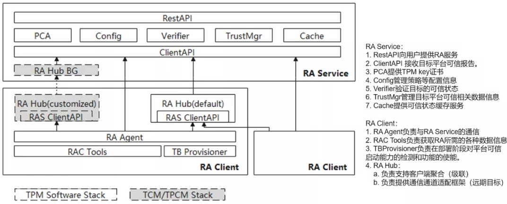

# 鲲鹏安全库(kunpengsecl)

## 介绍
本项目开发运行在鲲鹏处理器上的基础安全软件组件，先期主要聚焦在远程证明等可信计算相关领域，使能社区安全开发者。

## 软件架构


## 安装教程
### 基于openEuler系统的安装
openEuler系统支持采用rpm的安装方式，首先，您可使用以下命令获取项目最新源代码。
```shell
$ git clone https://gitee.com/openeuler/kunpengsecl.git
```
为了更方便地进行rpm包的制作与安装，您可在获取项目源代码后，在kunpengsecl根目录执行`make rpm`自动进行rpm打包工作。

rpm包制作完成后，请进入kunpengsecl父目录下的**rpmbuild/RPMS/x86_64(aarch64)**目录，安装您所需要的rpm包。
```shell
$ rpm -ivh kunpengsecl-ras-1.1.1-1.x86_64(aarch64).rpm
```
若您此后不再需要本程序，也可通过以下命令进行卸载。
```shell
$ rpm -e kunpengsecl-ras-1.1.1-1.x86_64(aarch64)
```
### 基于Ubuntu系统的安装
Ubuntu系统不支持rpm的安装方式，但我们仍为您提供了一种选择。

在获取项目源代码后，对于服务器RAS和客户端RAC的安装，分别进入**kunpengsecl/attestation/ras**和**kunpengsecl/attestation/rac**目录，执行`make install`命令即可自动编译程序并将相应文件安装到缺省位置。

另外也支持在kunpengsecl根目录执行`make install`同时安装RAS和RAC。

若您需要自定义安装目录，可使用以下任一命令。
```shell
$ make DESTDIR=/xxx/xxx install
$ make install DESTDIR=/xxx/xxx
```

对于服务器RAS和客户端RAC的卸载，分别进入**kunpengsecl/attestation/ras**和**kunpengsecl/attestation/rac**目录下执行`make uninstall`命令即可自动清理安装文件.

若您需要指定文件目录，那么可选择以下任一卸载指令格式。
```shell
$ make DESTDIR=/xxx/xxx uninstall
$ make uninstall DESTDIR=/xxx/xxx
```

## 使用说明
### 软件配置
为了保证程序的正常运行，必须准备好正确的数据库环境，这需要您先进入**usr/share/attestation/ras**目录，然后执行**prepare-database-env.sh**脚本进行自动化的数据库环境配置。

除此之外，程序运行所依赖的配置文件默认有三个读取路径，分别为当前目录"./config.yaml"，家目录"${HOME}/.config/attestation/ras(rac)(rahub)/config.yaml"，以及系统目录"/etc/attestation/ras(rac)(rahub)/config.yaml"。

如果您需要创建家目录配置文件，可在安装好rpm包后，执行位于**usr/share/attestation/ras(rac)(rahub)**下的脚本**prepare-ras(rac)(hub)conf-env.sh**，从而自动完成家目录配置文件的部署。

### RAS启动参数
命令行输入`ras`即可启动RAS程序。在RAS目录下需要提供`ECDSA`公钥并命名为`ecdsakey.pub`。相关参数如下：
```
  -H  --https         http/https模式开关，默认为https(true)，false=http
  -h  --hport         https模式下RAS监听的restful api端口
  -p, --port string   RAS监听的client api端口
  -r, --rest string   http模式下RAS监听的restful api端口
  -T, --token         生成一个测试用的验证码并退出
  -v, --verbose       打印更详细的RAS运行时日志信息
  -V, --version       打印RAS版本并退出
```

### RAC启动参数
命令行输入`sudo raagent`即可启动RAC程序，请注意，物理TPM模块的开启需要sudo权限。相关参数如下：
```
  -s, --server string   指定待连接的RAS服务端口
  -t, --test            true=以测试模式启动，false=以正常模式启动
  -v, --verbose         打印更详细的RAC运行时日志信息
  -V, --version         打印RAC版本并退出
  -i, --imalog          指定ima文件路径
  -b, --bioslog         指定bios文件路径
```

### 接口定义
为了便于管理员对目标服务器以及RAS进行管理，本程序设计了以下接口可供调用：
```
/: GET
/{id}: GET、POST、DELETE
/{from}/{to}: GET
/{id}/reports: GET
/{id}/reports/{reportid}: GET、DELETE
/{id}/basevalues: GET
/{id}/newbasevalue: POST
/{id}/basevalues/{basevalueid}: GET、POST、DELETE
/version: GET
/login: GET
/config: GET、POST
/{id}/container/status: GET
/{id}/device/status: GET
```
接下来分别介绍上述接口的具体用法。
***
若您想要查询所有服务器的信息，那么您可以使用`"/"`接口。
```shell
$ curl -X GET -H "Content-Type: application/json" http://localhost:40002/
```
***
若您想要查询目标服务器的详细信息，那么您可以使用`"/{id}"`接口的`GET`方法，其中{id}是RAS为目标服务器分配的唯一标识号。
```shell
$ curl -X GET -H "Content-Type: application/json" http://localhost:40002/1
```
***
若您想要修改目标服务器的信息，那么您可以使用`"/{id}"`接口的`POST`方法，其中$AUTHTOKEN是您事先使用`ras -T`自动生成的身份验证码。
```go
type clientInfo struct {
	Registered   *bool `json:"registered"`  // 目标服务器注册状态
	IsAutoUpdate *bool `json:"isautoupdate"`// 目标服务器基准值更新策略
}
```
```shell
$ curl -X POST -H "Authorization: $AUTHTOKEN" -H "Content-Type: application/json" http://localhost:40002/1 -d '{"registered":false, "isautoupdate":false}'
```
***
若您想要删除目标服务器，那么您可以使用`"/{id}"`接口的`DELETE`方法，注意：使用该方法并非删除目标服务器的所有信息，而是把目标服务器的注册状态置为`false`！
```shell
$ curl -X DELETE -H "Authorization: $AUTHTOKEN" -H "Content-Type: application/json" http://localhost:40002/1
```
***
若您想要查询指定范围内的所有服务器信息，那么您可以使用`"/{from}/{to}"`接口的`GET`方法。
```shell
$ curl -X GET -H "Content-Type: application/json" http://localhost:40002/1/9
```
***
若您想要查询目标服务器的所有可信报告，那么您可以使用`"/{id}/reports"`接口的`GET`方法。
```shell
$ curl -X GET -H "Content-Type: application/json" http://localhost:40002/1/reports
```
***
若您想要查询目标服务器指定可信报告的详细信息，那么您可以使用`"/{id}/reports/{reportid}"`接口的`GET`方法，其中{reportid}是RAS为目标服务器指定可信报告分配的唯一标识号。
```shell
$ curl -X GET -H "Content-Type: application/json" http://localhost:40002/1/reports/1
```
***
若您想要删除目标服务器指定可信报告，那么您可以使用`"/{id}/reports/{reportid}"`接口的`DELETE`方法，注意，使用该方法将删除指定可信报告的所有信息，您将无法再通过接口对该报告进行查询！
```shell
$ curl -X DELETE -H "Authorization: $AUTHTOKEN" -H "Content-Type: application/json" http://localhost:40002/1/reports/1
```
***
若您想要查询目标服务器的所有基准值，那么您可以使用`"/{id}/basevalues"`接口的`GET`方法。
```shell
$ curl -X GET -H "Content-Type: application/json" http://localhost:40002/1/basevalues
```
***
若您想要给目标服务器新增一条基准值信息，那么您可以使用`"/{id}/newbasevalue"`接口的`POST`方法。
```go
type baseValueJson struct {
	BaseType   string `json:"basetype"`   // 基准值类型
	Uuid       string `json:"uuid"`       // 容器或设备的标识号
	Name       string `json:"name"`       // 基准值名称
	Enabled    bool   `json:"enabled"`    // 基准值是否可用
	Pcr        string `json:"pcr"`        // PCR值
	Bios       string `json:"bios"`       // BIOS值
	Ima        string `json:"ima"`        // IMA值
	IsNewGroup bool   `json:"isnewgroup"` // 是否为一组新的基准值
}
```
```shell
$ curl -X POST -H "Authorization: $AUTHTOKEN" -H "Content-Type: application/json" http://localhost:40002/1/newbasevalue -d '{"name":"test", "basetype":"host", "enabled":true, "pcr":"testpcr", "bios":"testbios", "ima":"testima", "isnewgroup":true}'
```
***
若您想要查询目标服务器指定基准值的详细信息，那么您可以使用`"/{id}/basevalues/{basevalueid}"`接口的`GET`方法，其中{basevalueid}是RAS为目标服务器指定基准值分配的唯一标识号。
```shell
$ curl -X GET -H "Content-Type: application/json" http://localhost:40002/1/basevalues/1
```
***
若您想要修改目标服务器指定基准值的可用状态，那么您可以使用`"/{id}/basevalues/{basevalueid}"`接口的`POST`方法。
```shell
$ curl -X POST -H "Content-type: application/json" -H "Authorization: $AUTHTOKEN" http://localhost:40002/1/basevalues/1 -d '{"enabled":true}'
```
***
若您想要删除目标服务器指定基准值，那么您可以使用`"/{id}/basevalues/{basevalueid}"`接口的`DELETE`方法，注意，使用该方法将删除指定基准值的所有信息，您将无法再通过接口对该基准值进行查询！
```shell
$ curl -X DELETE -H "Authorization: $AUTHTOKEN" -H "Content-Type: application/json" http://localhost:40002/1/basevalues/1
```
***
若您想要获取本程序的版本信息，那么您可以使用`"/version"`接口的`GET`方法。
```shell
$ curl -X GET -H "Content-Type: application/json" http://localhost:40002/version
```
***
若您想要查询目标服务器/RAS/数据库的配置信息，那么您可以使用`"/config"`接口的`GET`方法。
```shell
$ curl -X GET -H "Content-Type: application/json" http://localhost:40002/config
```
***
若您想要修改目标服务器/RAS/数据库的配置信息，那么您可以使用`"/config"`接口的`POST`方法。
```go
type cfgRecord struct {
  // 目标服务器配置
	HBDuration      string `json:"hbduration" form:"hbduration"`
	TrustDuration   string `json:"trustduration" form:"trustduration"`
  	DigestAlgorithm string `json:"digestalgorithm" form:"digestalgorithm"`
  // 数据库配置
	DBHost          string `json:"dbhost" form:"dbhost"`
	DBName          string `json:"dbname" form:"dbname"`
	DBPassword      string `json:"dbpassword" form:"dbpassword"`
	DBPort          int    `json:"dbport" form:"dbport"`
	DBUser          string `json:"dbuser" form:"dbuser"`
  // RAS配置
	MgrStrategy     string `json:"mgrstrategy" form:"mgrstrategy"`
	ExtractRules    string `json:"extractrules" form:"extractrules"`
  	IsAllupdate     *bool  `json:"isallupdate" form:"isallupdate"`
	LogTestMode     *bool  `json:"logtestmode" form:"logtestmode"`
}
```
```shell
$ curl -X POST -H "Authorization: $AUTHTOKEN" -H "Content-Type: application/json" http://localhost:40002/config -d '{"hbduration":"5s","trustduration":"20s","DigestAlgorithm":"sha256"}'
```

## FAQ
1.为什么在进行rpm打包时报错？

>因为在进行实际的rpm打包前，会先完成程序的自动化编译工作，这依赖于多个软件包工具，若您出现编译错误的问题，可尝试执行**kunpengsecl/attestation/quick-scripts**目录下的**prepare-build-env.sh**脚本准备必需的编译环境。
```shell
$ bash ./attestation/quick-scripts/prepare-build-env.sh
```

2.为什么ras启动后，通过restapi无法访问？

>因为ras默认以https模式启动，这需要您向ras提供合法的证书才能正常访问，而http模式下启动的ras则不需要提供证书。

## 参与贡献

1.  Fork 本仓库
2.  新建 Feat_xxx 分支
3.  提交代码
4.  新建 Pull Request

