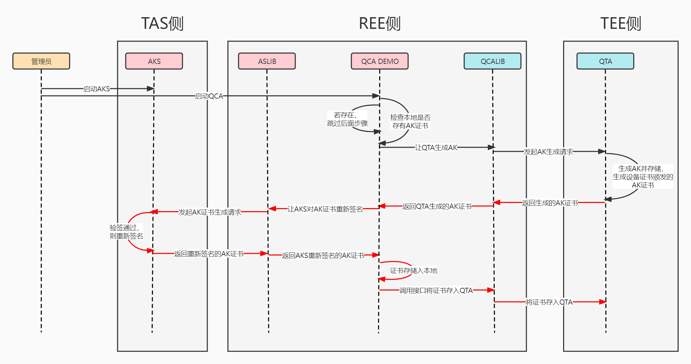
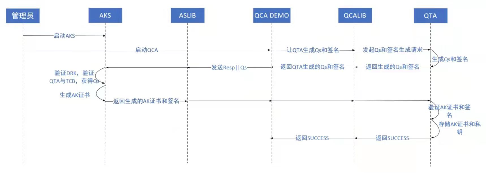
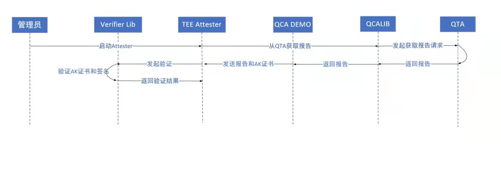

## 场景需求

独立实现场景：用户可基于 TEE Verifier Lib 和 QCA Lib（由华为对外发布）自行编写 TEE Attester 来验证 TEE 中用户 TA 的完整性， 使用 TEE AK Service 生成AK。

## 模块设计

TEE远程证明独立实现场景的开发分为以下3个模块：QCA举证应用、Attester求证应用、AK Service证明密钥服务端。

### QCA

#### qcatools方法描述

QCA Demo的工具包，用以支持QCA Demo初始化命令行参数、初始化配置、与QCA Lib进行交互等。  
qcatools的对外方法如下：
```go
func InitFlags()
```
方法描述：初始化QCA Demo启动时的命令行参数。  
可用命令行参数如下：
```
-C, --scenario int32   设置QCA Demo的使用场景
-S, --server string    指定QCA Demo可以被客户端连接的IP地址
```
目前支持的场景有：
```go
RA_SCENARIO_NO_AS = 0 // 无AKS场景，对应最小实现
RA_SCENARIO_AS_NO_DAA = 1 // 有AKS无DAA场景
RA_SCENARIO_AS_WITH_DAA = 2 // 有AKS有DAA场景
```
***
```go
func LoadConfigs()
```
方法描述：加载预定义的配置。  
目前的默认配置为：
```yaml
qcaconfig:
  server: 127.0.0.1:40007
  akserver: 127.0.0.1:40008
  scenario: 0
  nodaaacfile: ./nodaa-ac.crt
  daaacfile: ./daa-ac.crt
```
***
```go
func HandleFlags()
```
方法描述：处理命令行参数。
***
```go
func GetTAReport(ta_uuid []byte, usr_data []byte, with_tcb bool) []byte
```
方法描述：调用QCA Lib接口获取TA的完整性报告。  
参数1：指定TA的唯一标识符UUID。  
参数2：用户传入的挑战数据，如nonce值，用以防重放攻击。  
参数3：指明是否携带TCB度量值。  
返回值：TA的完整性报告。
***
```go
func GenerateAKCert() ([]byte, error)
```
方法描述：根据不同使用场景请求QCA Lib返回相应证书。  
返回值1：DER格式的AK证书，无AKS场景返回为空。  
返回值2：错误输出。
***
```go
func SaveAKCert(cert []byte) error
```
方法描述：将AKS签发的AK证书保存入TEE环境。  
参数：DER格式的AK证书。  
返回值：错误输出。
***

#### qapi方法描述

QCA Demo与外交互的接口，向外提供TA的完整性报告。  
qapi的对外方法如下：
```go
func StartServer()
```
方法描述：QCA Demo的启动入口。
>QCA Demo启动后，若使用场景为有AKS场景，则会先检查本地指定路径下是否存有AKS签发的AK证书。若有，那么跳过后续与QCA Lib及AKS的交互步骤，直接开始监听自己对外提供的服务端口；若没有，那么需要发起与QCA Lib和AKS的交互，并将最终AKS签发的AK证书存于本地指定路径。
***
```go
func DoGetTeeReport(addr string, in *GetReportRequest) (*GetReportReply, error)
```
方法描述：供外部平台调用的接口，用以获取指定TA的完整性报告。  
参数1：待连接服务端的IP:Port地址，这里的服务端即QCA Demo。  
参数2：gRPC请求参数，包含uuid、nonce、with_tcb三个字段。  
返回值1：gRPC响应参数，包含TA的完整性报告的字节数组。
返回值2：错误输出。
***
```go
func (s *service) GetReport(ctx context.Context, in *GetReportRequest) (*GetReportReply, error)
```
方法描述：gRPC中对应获取指定TA完整性报告的服务。  
参数1：服务请求的上下文信息。  
参数2：gRPC请求参数，包含uuid、nonce、with_tcb三个字段。  
返回值1：gRPC响应参数，包含TA的完整性报告的字节数组。
返回值2：错误输出。
***

#### aslib方法描述

QCA Demo与AK Service交互的接口，用以请求AKS签发AK证书。  
aslib的对外方法如下：
```go
func GetAKCert(oldAKCert []byte, scenario int32) ([]byte, error)
```
方法描述：通过AKS提供的clientapi请求AKS签发指定场景的AK证书。  
参数1：TEE环境中自签名的AK证书。  
参数2：指定服务的使用场景，主要是NoDAA/DAA场景。  
返回值1：由AKS重新签发的AK证书。  
返回值2：错误输出。
***

### Attester

#### attestertools方法描述

Attester的工具包，用以支持Attester Demo初始化命令行参数、初始化配置、与QCA Demo进行交互等。  
attestertools的对外方法如下：
```go
func InitFlags()
```
方法描述：初始化Attester Demo启动时的命令行参数。  
可用命令行参数如下：
```
-B, --basevalue string   设置基准值文件的读取路径
-M, --mspolicy int       设置待使用的度量策略
-S, --server string      指定待连接的服务器端口
-T, --test               开启测试模式，使用固定的nonce值
-U, --uuid string        指定待验证的TA
-V, --version            打印版本号并退出程序
```
***
```go
func LoadConfigs()
```
方法描述：加载预定义的配置。  
目前的默认配置为：
```yaml
attesterconfig:
  server: 127.0.0.1:40007
  basevalue: "./basevalue.txt"
  mspolicy: 2
  uuid: f68fd704-6eb1-4d14-b218-722850eb3ef0
```
***
```go
func HandleFlags()
```
方法描述：处理命令行参数。
***
```go
func StartAttester()
```
方法描述：Attester Demo的启动入口。
>用户可通过读取Attester Demo的运行日志判断指定TA的度量结果。
***

### AK Service 

#### akissuer方法描述

akissuer实现NoDAA/DAA协议帮助生成AK证书。  
akissuer的对外方法如下：
```go
func GenerateAKCert(oldAKCert []byte, scenario int32) ([]byte, error)
```
方法描述：AKS对设备自签名的AK证书进行重新签名。  
参数1：原始AK证书的[]byte值。  
参数2：对应生成AK证书的场景。1 ---> NoDAA证书 ; 2 ---> DAA证书  
返回值1：由AKS重新签名的AK证书[]byte值。  
返回值2：错误输出。
***

#### clientapi方法描述

clientapi接收目标平台AK证书生成请求。  
clientapi的对外方法如下：
```go
func (s *service) GetAKCert(ctx context.Context, in *GetAKCertRequest) (*GetAKCertReply, error)
```
方法描述：gRPC中对应生成指定场景AK证书的服务。  
参数1：服务请求的上下文信息。  
参数2：gRPC请求参数，包含akcert、scenario两个字段。  
返回值1：gRPC响应参数，包含AKS签发的AK证书的字节数组。
返回值2：错误输出。
***
```go
func StartServer(addr string)
```
方法描述：AKS对客户端的服务启动入口。  
参数：AKS服务端的IP:Port地址。
***
```go
func DoGetAKCert(addr string, in *GetAKCertRequest) (*GetAKCertReply, error)
```
方法描述：供外部平台调用的接口，用以获取AKS重新签名的AK证书。  
参数1：待连接服务端的IP:Port地址，这里的服务端即AKS。  
参数2：gRPC请求参数，包含akcert、scenario两个字段。  
返回值1：gRPC响应参数，包含AKS签发的AK证书的字节数组。
返回值2：错误输出。
***

#### config方法描述

AKS的配置服务包，用以获取、修改AKS的指定配置。  
config的对外方法如下：
```go
func InitFlags()
```
方法描述：初始化AKS启动时的命令行参数。  
可用命令行参数如下：
```
-T, --token   为restapi服务生成测试token
```
***
```go
func LoadConfigs()
```
方法描述：加载预定义的配置。  
目前的默认配置为：
```yaml
tasconfig:
  port: 127.0.0.1:40008
  rest: 127.0.0.1:40009
  akskeycertfile: ./ascert.crt
  aksprivkeyfile: ./aspriv.key
  huaweiitcafile: ./Huawei IT Product CA.pem
  DAA_GRP_KEY_SK_X: 65A9BF91AC8832379FF04DD2C6DEF16D48A56BE244F6E19274E97881A776543C
  DAA_GRP_KEY_SK_Y: 126F74258BB0CECA2AE7522C51825F980549EC1EF24F81D189D17E38F1773B56
  basevalue: "cc0fe80b4510b3c8d5bf6308024676d2d9e83fbb05ba3d23cd645bfb573ae8a1 bd9df1a7f941c572c14723b80a0fbd805d52641bbac8325681a19d8ba8487b53"
  authkeyfile: ./ecdsakey.pub
```
***
```go
func InitializeAS() error
```
方法描述：对AKS进行初始化。
>本方法主要实现解析AKS的证书、私钥以及解析华为证书的功能，因此要求用户预先在指定路径下配置好相应的AKS证书、AKS私钥以及华为证书，否则AKS将无法正常启动。
***
```go
func GetConfigs() *tasConfig
```
方法描述：获取AKS的所有配置信息。  
返回值：AKS的配置信息。
***
```go
func GetServerPort() string
```
方法描述：获取AKS的clientapi服务端口地址。  
返回值：AKS的clientapi服务端口地址。
***
```go
func GetRestPort() string
```
方法描述：获取AKS的restapi服务端口地址。  
返回值：AKS的restapi服务端口地址。
***
```go
func GetASCertFile() string
```
方法描述：获取AKS证书的文件路径。  
返回值：AKS证书的文件路径。
***
```go
func GetASKeyFile() string
```
方法描述：获取AKS私钥的文件路径。  
返回值：AKS私钥的文件路径。
***
```go
func GetHWCertFile() string
```
方法描述：获取华为证书的文件路径。  
返回值：华为证书的文件路径。
***
```go
func GetASCert() *x509.Certificate
```
方法描述：获取AKS证书。  
返回值：x509格式的AKS证书。
***
```go
func GetASPrivKey() *rsa.PrivateKey
```
方法描述：获取AKS私钥。  
返回值：RSA格式的AKS私钥。
***
```go
func GetHWCert() *x509.Certificate
```
方法描述：获取华为证书。  
返回值：x509格式的华为证书。
***
```go
func GetDAAGrpPrivKey() (string, string)
```
方法描述：获取DAA私钥。  
返回值：DAA私钥X和DAA私钥Y。
***
```go
func GetAuthKeyFile() string
```
方法描述：获取restapi服务的验证密钥文件路径。  
返回值：验证密钥的文件路径。
***
```go
func GetBaseValue() string
```
方法描述：获取对原始AK证书中qta度量数据进行度量的基准值。  
返回值：基准值信息。
***
```go
func SetBaseValue(s string)
```
方法描述：设置对原始AK证书中qta度量数据进行度量的基准值。  
参数：待设置的基准值。
***

#### restapi方法描述

restapi向用户提供信息维护服务。  
restapi的对外方法如下：
```go
func StartServer(addr string)
```
方法描述：AKS对客户端的服务启动入口。  
参数：AKS服务端的IP:Port地址。
***
```go
func CreateTestAuthToken() ([]byte, error)
```
方法描述：生成测试用的token值供用户请求restapi服务时使用。  
返回值1：基于JSON的token值字节数组。  
返回值2：错误输出。
***
```go
func CreateAuthValidator(v JWSValidator) (echo.MiddlewareFunc, error)
```
方法描述：生成restapi服务中对JWT进行验证的中间层。  
返回值1：JWT验证器中间件。  
返回值2：错误输出。
***
```go
func (s *MyRestAPIServer) GetConfig(ctx echo.Context) error
```
方法描述：允许用户读取AKS的配置信息，目前只允许读取基准值。  
参数：请求上下文。    
返回值：错误输出。  
使用示例：
```s
curl -X GET -H "Content-Type: application/json" http://localhost:40009/config
```
***
```go
func (s *MyRestAPIServer) PostConfig(ctx echo.Context) error
```
方法描述：允许用户修改AKS的配置信息，目前只允许修改基准值。  
参数：请求上下文。  
返回值：错误输出。  
使用示例：
```s
curl -X POST -H "Content-Type: application/json" -H "Authorization: $AUTHTOKEN" -d '{"basevalue":"testvalue"}' http://localhost:40009/config
```
***

## 流程图

### NoDAA场景



### DAA场景



### 验证流程图


