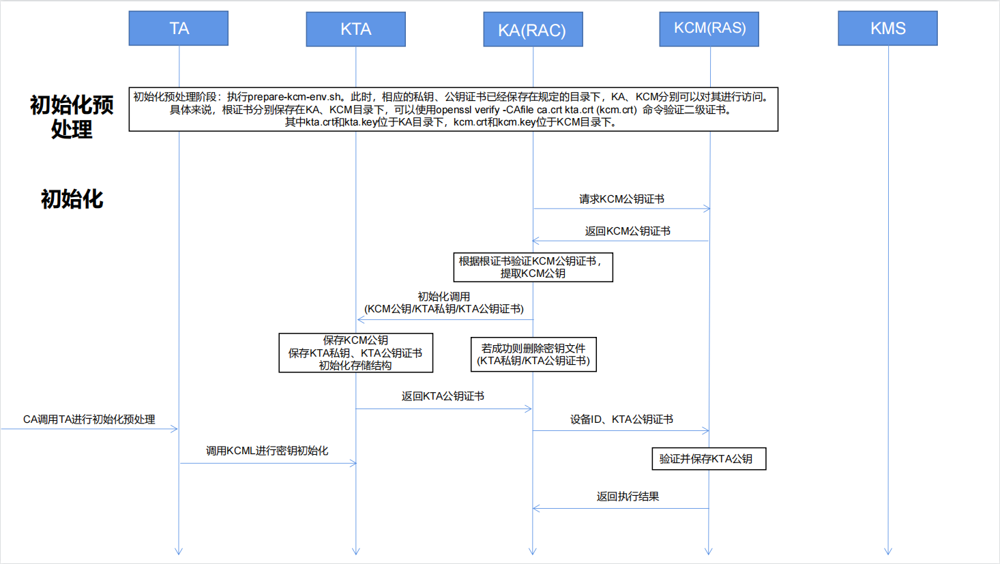
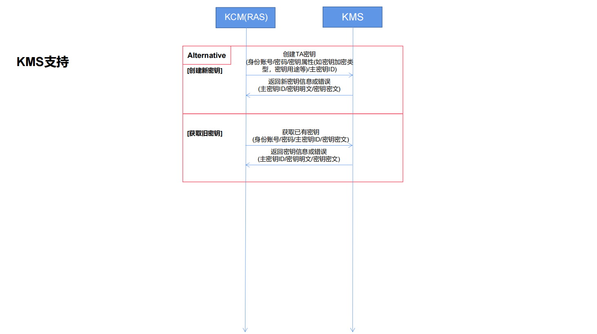

## 实体介绍

### KCM Service介绍

KCM Service作为密钥缓存管理服务端，向外支持对接KMIP兼容KMS服务，向内提供密钥安全缓冲协议接口。其中，ClientAPI接收KA转发的密钥请求，Kcmstools实现密钥缓存相关的操作，Kdb实现相应的数据库操作。

## 接口介绍

### KCM Service接口

KCM Service作为密钥缓存管理的服务端，通过ClientAPI与KA进行交互。主要提供的接口为：1.向KA返回KCM公钥证书接口；2.验证KTA的公钥证书接口；3.调用Kcmstools的相关函数进行密钥缓存相关的操作。

```go
func DoSendKCMPubKeyCertWithConn(ras *RasConn, in *SendKCMPubKeyCertRequest) (*SendKCMPubKeyCertReply, error);
```

接口描述：接收KA传入的信息，并传给clientapi的SendKCMPubKeyCert函数进行下一步处理。

参数1：ras连接。

参数2：空值（包含在Request中，下同）。

返回值1：KCM公钥证书（包含在Reply中，下同）。

返回值2：错误输出。

-----

```go
func DoVerifyKTAPubKeyCertWithConn(ras *RasConn, in *VerifyKTAPubKeyCertRequest) (*VerifyKTAPubKeyCertReply, error);
```

接口描述：接收KA传入的信息，并传给clientapi的VerifyKTAPubKeyCert函数进行下一步处理

参数1：ras连接

参数2：KA所在RAC的设备ID、KTA公钥证书（[]byte类型）。

返回值1：KA所在RAC的设备ID（出错时将数值设置为-1）

返回值2：错误输出。

------

```go
func DoKeyOperationWithConn(ras *RasConn, in *KeyOperationRequest) (*KeyOperationReply, error);
```

接口描述：接收KA传入的信息，并传给clientapi的DoKeyOperationWithConn函数进行下一步处理

参数1：ras连接

参数2：加密后的入参，包括：TA的身份ID、TA登录KMS的账号、TA登录KMS的密码、TA请求获取的密钥ID、TA请求生成新密钥需要依据的主密钥的ID（均为[]byte类型）

返回值1：密钥操作函数运行成功标志（bool类型）加密后的出参，包括：TA的身份ID、密钥ID、密钥明文、TA请求生成新密钥需要依据的主密钥的ID、KTA公钥加密过的会话密钥密文（均为byte[]类型）

返回值2：错误输出。

-----

```go
func (s *rasService) SendKCMPubKeyCert(ctx context.Context, in *SendKCMPubKeyCertRequest) (*SendKCMPubKeyCertReply, error);
```

接口描述：调用kcmstools中的SendKCMPubKeyCert函数进行下一步处理，将其返回的数据返回给DoSendKCMPubKeyCertWithConn

参数1：ras连接的Context

参数2：空值（包含在Request中，下同）

返回值1：KCM公钥证书（包含在Reply中，下同）

返回值2：错误输出。

----

```go
func (s *rasService) VerifyKTAPubKeyCert(ctx context.Context, in *VerifyKTAPubKeyCertRequest) (*VerifyKTAPubKeyCertReply, error);
```

接口描述：接收DoVerifyKTAPubKeyCertWithConn的输入，对输入参数进行解析，调用kcmstools中的VerifyKTAPubKeyCert进行下一步处理，将其返回的数据返回给DoVerifyKTAPubKeyCertWithConn

参数1：ras连接的Context。

参数2：KA所在RAC的设备ID、KTA公钥证书（[]byte类型）。

返回值1：KA所在RAC的设备ID（出错时将数值设置为-1）。

返回值2：错误输出。

----

```go
func (s *rasService) KeyOperation(ctx context.Context, in *KeyOperationRequest) (*KeyOperationReply, error);
```

接口描述：接收DoKeyOperationWithConn传入的信息，对输入参数进行解析，选择kcmstools中的对应密钥操作函数进行调用和下一步处理，对其返回的数据进行加密再返回给DoKeyOperationWithConn

参数1：ras连接的Context

参数2：加密后的入参，包括：TA的身份ID、TA登录KMS的账号、TA登录KMS的密码、TA请求获取的密钥ID、TA请求生成新密钥需要依据的主密钥的ID（均为[]byte类型）

返回值1：密钥操作函数运行成功标志（bool类型）加密后的出参，包括：TA的身份ID、密钥ID、密钥明文、TA请求生成新密钥需要依据的主密钥的ID、KTA公钥加密过的会话密钥密文（均为byte[]类型）

返回值2：错误输出。

>注：目前KCM Service支持的应用场景分为初始化场景、生成新密钥场景、获取旧密钥场景、删除密钥场景以及数据库操作场景，分别由不同的函数接口进行实现。

**初始化场景接口**

KCM Servie初始化操作分为两个步骤，首先是发送KCMS公钥证书，然后是验证并保存KTA公钥。

```go
func SendKCMPubKeyCert() ([]byte, error);
```

接口描述：请求KCM Service返回KCMS的公钥证书

返回值1：KCMS公钥证书的[]byte值。

返回值2：错误输出。

---

```go
func VerifyKTAPubKeyCert(deviceId int64, ktaPubKeyCert []byte) error;
```

接口描述：验证KTA发送的公钥证书，并保存KTA公钥

参数1：KA所在RAC的设备ID。

参数2：KTA公钥证书的[]byte值。

返回值：错误输出。

**生成新密钥场景接口**

```go
func GenerateNewKey(taid []byte, account []byte, password []byte, hostkeyid []byte) ([]byte, []byte, []byte, []byte, []byte, error);
```

接口描述：请求KCM Service让KMS依据主密钥ID生成新的密钥，并生成密钥ID，将密钥密文和密钥ID保存下来，返回密钥明文和密钥ID，并对返回值进行加密保护。

参数1：TA的身份ID的[]byte值。

参数2：TA登录KMS的账号的[]byte值。

参数3：TA登录KMS的密码的[]byte值。

参数4：TA请求生成新密钥需要依据的主密钥的ID的[]byte值。

返回值1：TA的身份ID的[]byte值。

返回值2：会话密钥的[]byte值。

返回值3：KTA公钥加密过的会话密钥密文。

返回值4：KMS生成的密钥明文。

返回值5：密钥ID的[]byte值。

返回值6：错误输出。

**获取旧密钥场景接口**

```go
func GetKey(taid []byte, account []byte, password []byte, keyid []byte, hostkeyid []byte) ([]byte, []byte, []byte, []byte, []byte, error);
```

接口描述：请求KCM Service依据密钥ID查询到相应的密钥密文，然后请求KMS依据主密钥ID解密旧的密钥，并返回密钥明文和密钥ID，其中需要对返回值进行加密保护。

参数1：TA的身份ID的[]byte值。

参数2：TA登录KMS的账号的[]byte值。

参数3：TA登录KMS的密码的[]byte值。

参数4：TA请求获取的密钥ID的[]byte值。

参数5：TA请求生成新密钥需要依据的主密钥的ID的[]byte值。

返回值1：TA的身份ID的[]byte值。

返回值2：会话密钥的[]byte值。

返回值3：KTA公钥加密过的会话密钥密文。

返回值4：密钥明文。

返回值5：密钥ID的[]byte值。

返回值6：错误输出。

**删除密钥场景接口**

```go
func DeleteKey(taid []byte, keyid []byte) error;
```

接口描述：请求KCM Service依据密钥ID删除相应的密钥

参数1：TA的身份ID的[]byte值。

参数2：TA需要删除的密钥ID的[]byte值。

返回值：错误输出。

**数据库操作场景接口**

KCM Servie数据库操作主要是针对密钥和KTA公钥，主要分为查询、删除和保存操作。

密钥部分：

```go
func FindKeyInfo(taid, keyid string) (*typdefs.KeyinfoRow, error); 
```

接口描述：根据TA的身份ID和密钥ID查询相应的密钥密文信息

参数1：TA的身份ID。

参数2：密钥的ID。

返回值1：查询到的密钥密文。

返回值2：错误输出。

---

```go
func DeleteKeyInfo(taid, keyid string) error;
```

接口描述：根据TA的身份ID和密钥ID删除相应的密钥密文信息

参数1：TA的身份ID。

参数2：密钥的ID。

返回值：错误输出。

----

```go
func SaveKeyInfo(taid, keyid, cipherkey string) (*typdefs.KeyinfoRow, error);
```

接口描述：保存密钥密文信息，其中包括TA的身份ID、密钥ID和密钥密文

参数1：TA的身份ID。

参数2：密钥的ID。

参数3：密钥密文。

返回值1：成功保存的密钥密文信息。

返回值2：错误输出。

----

KTA公钥部分：

```go
func FindPubKeyInfo(deviceid int64) (*typdefs.PubKeyinfoRow, error); 
```

接口描述：根据设备ID查询相应的KTA公钥证书信息

参数：设备ID的值。

返回值1：查询到的KTA公钥证书。

返回值2：错误输出。

----

```go
func DeletePubKeyInfo(deviceid int64) error;
```

接口描述：根据设备ID删除相应的KTA公钥证书信息。

参数：设备ID的值。

返回值：错误输出。

----

```go
func SavePubKeyInfo(deviceid int64, pubkeycert string) (*typdefs.PubKeyinfoRow, error);
```

接口描述：保存KTA公钥信息，其中包括设备ID和KTA的公钥证书。

参数1：设备ID的值。

参数2：KTA的公钥证书。

返回值1：成功保存的KTA公钥证书信息。

返回值2：错误输出。

#### 流程图
KCMS初始化过程如下图所示：



KCMS获取密钥以及访问鉴权过程如下图所示：


KCMS删除密钥过程如下图所示：


KCMS与KMS交互过程如下图所示：

