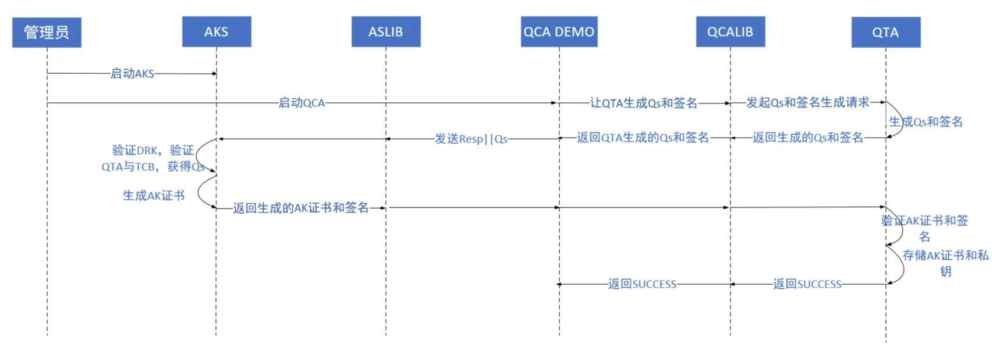
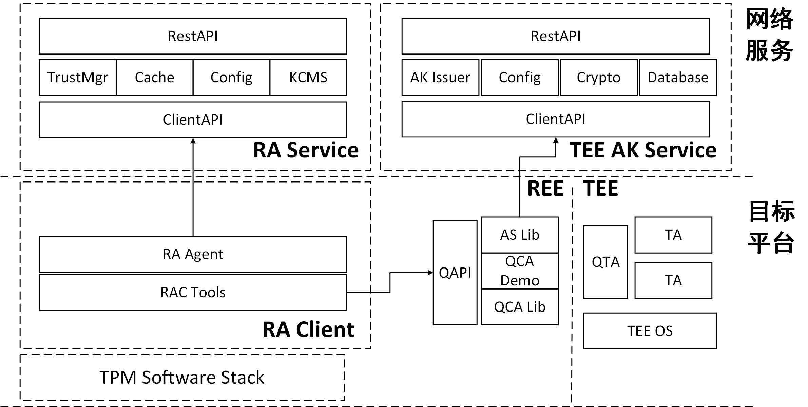

# TEE设计文档

<!-- TOC -->

  - [TEE特性实现](#tee特性实现)
      - [远程证明特性](#远程证明特性)
          - [实体介绍](#实体介绍)
              - [QCA_DEMO介绍](#qca_demo介绍)
              - [ATTESTER_DEMO介绍](#attester_demo介绍)
              - [VERIFIER_LIB介绍](#verifier_lib介绍)
              - [AK_Service介绍](#ak_service介绍)
          - [接口介绍](#接口介绍)
              - [QCA接口](#qca接口)
              - [ATTESTER接口](#attester接口)
              - [AK_Service接口](#ak_service接口)
          - [流程架构图](#流程架构图)
              - [最小实现](#最小实现)
              - [独立实现](#独立实现)
              - [整合实现](#整合实现)
      - [密钥缓存管理特性](#密钥缓存管理特性)
          - [实体介绍](#实体介绍-1)
              - [KTA介绍](#kta介绍)
              - [KA介绍](#ka介绍)
              - [KCMS介绍](#kcms介绍)
          - [数据定义](#数据定义)
              - [KTA关键常量](#kta关键常量)
              - [KTA参数声明](#kta参数声明)
              - [KTA关键数据结构](#kta关键数据结构)
              - [KA关键常量](#ka关键常量)
              - [KA关键数据结构](#ka关键数据结构)
              - [KCMS关键常量](#kcms关键常量)
              - [KCMS关键数据结构](#kcms关键数据结构)
          - [接口描述](#接口描述)
              - [KTA接口](#kta接口)
              - [KA接口](#ka接口)
              - [KCMS接口](#kcms接口)
          - [流程图](#流程图)
              - [密钥缓存初始化](#密钥缓存初始化)
              - [密钥访问鉴权&密钥获取](#密钥访问鉴权密钥获取)
              - [密钥缓存清理](#密钥缓存清理)
              - [本地证明&远程证明](#本地证明远程证明)
              - [KMS支持](#kms支持)

<!-- TOC -->

## 远程证明特性

TEE远程证明是鲲鹏安全生态开源组件鲲鹏安全库的一个重要特性，支撑基于鲲鹏平台构建开源机密计算解决方案。

当数据中心管理工具/管理员、云服务基础设施编排工具、密钥管理中心/模型提供方希望获取目标服务器上TEE中TA的可信状态时，需要触发TEE远程证明特性的功能。

### 实体介绍

#### QCA_DEMO介绍

QCA_DEMO在本方案中担任了服务端的角色，主要功能是本地调用QCA_LIB获取TEE中TA的可信报告，然后通过提供一个接口QAPI与位于其他平台的客户端进行交互，传输可信报告。其下分有main.go、qapi.go、qcatools.go三个模块，各自实现不同的功能。另外，由于QCA_DEMO采用Go语言开发，而QCA_LIB采用C语言开发，所以QCA_DEMO同时还借助CGO机制，提供了将C语言编写的可信报告转换为Go语言编写的可信报告的功能。

#### ATTESTER_DEMO介绍

ATTESTER_DEMO在本方案中担任了客户端的角色，主要功能是将从远程获取的TEE中TA的可信报告，本地调用VERIFIER_LIB进行可信验证，包含身份验证和完整性验证，并向管理员返回验证结果。其下分有main.go、attestertools.go两个模块，各自实现不同的功能。另外，由于ATTESTER_DEMO采用Go语言开发，而VERIFIER_LIB采用C语言开发，所以ATTESTER_DEMO同时还借助CGO机制，提供了将Go语言编写的可信报告转换为C语言编写的可信报告的功能。

#### VERIFIER_LIB介绍

VERIFIER_LIB实现TA完整性策略引擎，帮助ATTESTER_DEMO完成TA完整性判定。其下主要分有teeverifier.c、teeverifier.h、common.h三个文件，其中teeverifier.h是teeverifier.c对应的头文件，定义了可向外部暴露的接口，common.h定义了库所用到的各个常量、数据结构、内部函数等，而teeverifier.c则是对外接口的具体功能实现。

#### AK_Service介绍

AK_Service作为证明密钥服务端，分场景实现对TA的AKey Cert进行数字签名的服务。其中，RestAPI向用户提供信息维护服务，ClientAPI接收目标平台AK生成请求， AK Issuer实现相应协议帮助生成AK，Crypto实现必要的密码算法。

### 接口介绍

#### QCA接口

##### qcatools方法描述

QCA Demo的工具包，用以支持QCA Demo初始化命令行参数、初始化配置、与QCA Lib进行交互等。  
qcatools的对外方法如下：
```go
func InitFlags()
```
方法描述：初始化QCA Demo启动时的命令行参数。  
可用命令行参数如下：
```
-C, --scenario int32   设置QCA Demo的使用场景
-S, --server string    指定QCA Demo可以被客户端连接的IP地址
```
目前支持的场景有：
```go
RA_SCENARIO_NO_AS = 0 // 无AKS场景，对应最小实现
RA_SCENARIO_AS_NO_DAA = 1 // 有AKS无DAA场景
RA_SCENARIO_AS_WITH_DAA = 2 // 有AKS有DAA场景
```
***
```go
func LoadConfigs()
```
方法描述：加载预定义的配置。  
目前的默认配置为：
```yaml
qcaconfig:
  server: 127.0.0.1:40007
  akserver: 127.0.0.1:40008
  scenario: 0
  nodaaacfile: ./nodaa-ac.crt
  daaacfile: ./daa-ac.crt
```
***
```go
func HandleFlags()
```
方法描述：处理命令行参数。
***
```go
func GetTAReport(ta_uuid []byte, usr_data []byte, with_tcb bool) []byte
```
方法描述：调用QCA Lib接口获取TA的完整性报告。  
参数1：指定TA的唯一标识符UUID。  
参数2：用户传入的挑战数据，如nonce值，用以防重放攻击。  
参数3：指明是否携带TCB度量值。  
返回值：TA的完整性报告。
***
```go
func GenerateAKCert() ([]byte, error)
```
方法描述：根据不同使用场景请求QCA Lib返回相应证书。  
返回值1：DER格式的AK证书，无AKS场景返回为空。  
返回值2：错误输出。
***
```go
func SaveAKCert(cert []byte) error
```
方法描述：将AKS签发的AK证书保存入TEE环境。  
参数：DER格式的AK证书。  
返回值：错误输出。
***

##### qapi方法描述

QCA Demo与外交互的接口，向外提供TA的完整性报告。  
qapi的对外方法如下：
```go
func StartServer()
```
方法描述：QCA Demo的启动入口。
>QCA Demo启动后，若使用场景为有AKS场景，则会先检查本地指定路径下是否存有AKS签发的AK证书。若有，那么跳过后续与QCA Lib及AKS的交互步骤，直接开始监听自己对外提供的服务端口；若没有，那么需要发起与QCA Lib和AKS的交互，并将最终AKS签发的AK证书存于本地指定路径。
***
```go
func DoGetTeeReport(addr string, in *GetReportRequest) (*GetReportReply, error)
```
方法描述：供外部平台调用的接口，用以获取指定TA的完整性报告。  
参数1：待连接服务端的IP:Port地址，这里的服务端即QCA Demo。  
参数2：gRPC请求参数，包含uuid、nonce、with_tcb三个字段。  
返回值1：gRPC响应参数，包含TA的完整性报告的字节数组。
返回值2：错误输出。
***
```go
func (s *service) GetReport(ctx context.Context, in *GetReportRequest) (*GetReportReply, error)
```
方法描述：gRPC中对应获取指定TA完整性报告的服务。  
参数1：服务请求的上下文信息。  
参数2：gRPC请求参数，包含uuid、nonce、with_tcb三个字段。  
返回值1：gRPC响应参数，包含TA的完整性报告的字节数组。
返回值2：错误输出。
***

##### aslib方法描述

QCA Demo与AK Service交互的接口，用以请求AKS签发AK证书。  
aslib的对外方法如下：
```go
func GetAKCert(oldAKCert []byte, scenario int32) ([]byte, error)
```
方法描述：通过AKS提供的clientapi请求AKS签发指定场景的AK证书。  
参数1：TEE环境中自签名的AK证书。  
参数2：指定服务的使用场景，主要是NoDAA/DAA场景。  
返回值1：由AKS重新签发的AK证书。  
返回值2：错误输出。
***

#### Attester接口

##### attestertools方法描述

Attester的工具包，用以支持Attester Demo初始化命令行参数、初始化配置、与QCA Demo进行交互等。  
attestertools的对外方法如下：
```go
func InitFlags()
```
方法描述：初始化Attester Demo启动时的命令行参数。  
可用命令行参数如下：
```
-B, --basevalue string   设置基准值文件的读取路径
-M, --mspolicy int       设置待使用的度量策略
-S, --server string      指定待连接的服务器端口
-T, --test               开启测试模式，使用固定的nonce值
-U, --uuid string        指定待验证的TA
-V, --version            打印版本号并退出程序
```
***
```go
func LoadConfigs()
```
方法描述：加载预定义的配置。  
目前的默认配置为：
```yaml
attesterconfig:
  server: 127.0.0.1:40007
  basevalue: "./basevalue.txt"
  mspolicy: 2
  uuid: f68fd704-6eb1-4d14-b218-722850eb3ef0
```
***
```go
func HandleFlags()
```
方法描述：处理命令行参数。
***
```go
func StartAttester()
```
方法描述：Attester Demo的启动入口。
>用户可通过读取Attester Demo的运行日志判断指定TA的度量结果。
***

##### VERIFIER_LIB方法描述

VERIFIER_LIB为Attester demo提供可信验证支持，返回验证结果给用户，接口主要有：
```c
int tee_verify_report(buffer_data *data_buf,buffer_data *nonce,int type, char *filename);
```
接口描述：对可信报告进行身份验证和完整性验证  
参数1：可信报告缓冲区指针，即通过事先调用QCA_LIB中RemoteAttestReport函数所更新的report参数  
参数2：用户提供的一个随机数，需要与可信报告中指定位置的nonce值进行比对，用于防重放攻击  
参数3：验证类型，即度量策略，1为仅比对img-hash值，2为仅比对hash值，3为同时比对img-hash和hash两个值  
参数4：基准值文件路径，可从该文件中读取基准值与可信报告中的度量值进行比对  
返回值：验证结果（0或-1或-2或-3）  
相应的返回值定义如下：
```c
enum error_status_code {
    TVS_ALL_SUCCESSED = 0, // 可信验证通过
    TVS_VERIFIED_NONCE_FAILED = -1, // nonce值不一致
    TVS_VERIFIED_SIGNATURE_FAILED = -2, // 签名或证书验证失败
    TVS_VERIFIED_HASH_FAILED = -3, // 度量值验证失败
};
```
***
本接口内部由以下三个函数实现对应功能：
```c
bool tee_verify_nonce(buffer_data *buf_data,buffer_data *nonce);
```
接口描述：验证可信报告中的nonce值是否与用户生成的一致  
参数1：可信报告缓冲区指针，即通过事先调用QCA_LIB中RemoteAttestReport函数所更新的report参数  
参数2：用户提供的nonce值缓冲区指针  
返回值：验证结果（true or false）  
***
```c
bool tee_verify_signature(buffer_data *report);
```
接口描述：验证报告签名和证书有效性，例如使用DRK证书对签名数据进行验签(noas)  
参数1：可信报告缓冲区指针，即通过事先调用QCA_LIB中RemoteAttestReport函数所更新的report参数  
返回值：验证结果（true or false）  

**ak_cert对应的固定字段、属性字段和数据字段：**

注：如果为noas情况，需要将akcert转换成如下的数据类型，从中获取到对应的ak_pub、sign_drk以及cert_drk等数据
```c
#define KEY_PURPOSE_SIZE 32
struct ak_cert
{
    uint32_t version;
    uint64_t ts;
    char purpose[KEY_PURPOSE_SIZE];
    uint32_t param_count;
    struct ra_params params[0];
    /* following buffer data:
     * (1)qta_img_hash []
     * (2)qta_mem_hash []
     * (3)reserverd []
     * (4)ak_pub []
     * (5)sign_drk []
     * (6)cert_drk []
     */
} __attribute__((__packed__));
```

**验证过程：**
1. 通过传入的缓冲区类型的report解析出对应的结构体类型的报告
2. 使用DRK证书对sign_drk进行验签（noas情况）
3. 从akcert中获取akpub对sign_ak进行验签
4. 返回验签结果
***
```c
bool tee_verify(buffer_data *buf_data, int type, char *filename);
```
接口描述：验证报告hash值  
参数1：可信报告缓冲区指针，即事先通过调用QCA_LIB中RemoteAttestReport函数所更新的report参数  
参数2：验证类型，即度量策略，1为仅比对img-hash值，2为仅比对hash值，3为同时比对img-hash和hash两个值  
参数3：基准值文件路径，可从该文件中读取基准值与可信报告中的度量值进行比对  

上述**基准值文件**的**格式要求**：

basevalue文件以十六进制字符串的形式存储基准值记录

每一条basevalue记录分为三项：uuid、image-hash、hash，项与项之间用空格间隔，记录之间用换行间隔

| column | uuid(xxxxxxxx-xxxx-xxxx-xxxx-xxxxxxxxxxxx) | img-hash | hash |
| --- | --- | --- | --- |
| digit |  (8-4-4-4-12) | 64 | 64 |
| content（e.g.） | B0019DC2-13CD-5A40-99F9-06343DFBE691 | FB4C924ECCE3D00021C97D7FE815F9400AFF90FB84D8A92651CDE3CA2AEB60B1 | 09972A4984CC521651B683B5C85DD9012104A9A57B165B3E26A7A237B7951AD0 |

返回值：验证结果（true or false）
***

>注意：本接口所需入参中验证类型和基准值文件路径都可通过启动客户端时所键入的命令行参数来进行自定义设置

由于**VERIFIER_LIB**是以C语言编写的，因此DEMO程序需要基于CGO机制实现对C接口的调用。

#### AK_Service接口

##### akissuer方法描述

akissuer实现NoDAA/DAA协议帮助生成AK证书。  
akissuer的对外方法如下：
```go
func GenerateAKCert(oldAKCert []byte, scenario int32) ([]byte, error)
```
方法描述：AKS对设备自签名的AK证书进行重新签名。  
参数1：原始AK证书的[]byte值。  
参数2：对应生成AK证书的场景。1 ---> NoDAA证书 ; 2 ---> DAA证书  
返回值1：由AKS重新签名的AK证书[]byte值。  
返回值2：错误输出。
***

##### clientapi方法描述

clientapi接收目标平台AK证书生成请求。  
clientapi的对外方法如下：
```go
func (s *service) GetAKCert(ctx context.Context, in *GetAKCertRequest) (*GetAKCertReply, error)
```
方法描述：gRPC中对应生成指定场景AK证书的服务。  
参数1：服务请求的上下文信息。  
参数2：gRPC请求参数，包含akcert、scenario两个字段。  
返回值1：gRPC响应参数，包含AKS签发的AK证书的字节数组。
返回值2：错误输出。
***
```go
func StartServer(addr string)
```
方法描述：AKS对客户端的服务启动入口。  
参数：AKS服务端的IP:Port地址。
***
```go
func DoGetAKCert(addr string, in *GetAKCertRequest) (*GetAKCertReply, error)
```
方法描述：供外部平台调用的接口，用以获取AKS重新签名的AK证书。  
参数1：待连接服务端的IP:Port地址，这里的服务端即AKS。  
参数2：gRPC请求参数，包含akcert、scenario两个字段。  
返回值1：gRPC响应参数，包含AKS签发的AK证书的字节数组。
返回值2：错误输出。
***

##### config方法描述

AKS的配置服务包，用以获取、修改AKS的指定配置。  
config的对外方法如下：
```go
func InitFlags()
```
方法描述：初始化AKS启动时的命令行参数。  
可用命令行参数如下：
```
-T, --token   为restapi服务生成测试token
```
***
```go
func LoadConfigs()
```
方法描述：加载预定义的配置。  
目前的默认配置为：
```yaml
tasconfig:
  port: 127.0.0.1:40008
  rest: 127.0.0.1:40009
  akskeycertfile: ./ascert.crt
  aksprivkeyfile: ./aspriv.key
  huaweiitcafile: ./Huawei IT Product CA.pem
  DAA_GRP_KEY_SK_X: 65A9BF91AC8832379FF04DD2C6DEF16D48A56BE244F6E19274E97881A776543C
  DAA_GRP_KEY_SK_Y: 126F74258BB0CECA2AE7522C51825F980549EC1EF24F81D189D17E38F1773B56
  basevalue: "cc0fe80b4510b3c8d5bf6308024676d2d9e83fbb05ba3d23cd645bfb573ae8a1 bd9df1a7f941c572c14723b80a0fbd805d52641bbac8325681a19d8ba8487b53"
  authkeyfile: ./ecdsakey.pub
```
***
```go
func InitializeAS() error
```
方法描述：对AKS进行初始化。
>本方法主要实现解析AKS的证书、私钥以及解析华为证书的功能，因此要求用户预先在指定路径下配置好相应的AKS证书、AKS私钥以及华为证书，否则AKS将无法正常启动。
***
```go
func GetConfigs() *tasConfig
```
方法描述：获取AKS的所有配置信息。  
返回值：AKS的配置信息。
***
```go
func GetServerPort() string
```
方法描述：获取AKS的clientapi服务端口地址。  
返回值：AKS的clientapi服务端口地址。
***
```go
func GetRestPort() string
```
方法描述：获取AKS的restapi服务端口地址。  
返回值：AKS的restapi服务端口地址。
***
```go
func GetASCertFile() string
```
方法描述：获取AKS证书的文件路径。  
返回值：AKS证书的文件路径。
***
```go
func GetASKeyFile() string
```
方法描述：获取AKS私钥的文件路径。  
返回值：AKS私钥的文件路径。
***
```go
func GetHWCertFile() string
```
方法描述：获取华为证书的文件路径。  
返回值：华为证书的文件路径。
***
```go
func GetASCert() *x509.Certificate
```
方法描述：获取AKS证书。  
返回值：x509格式的AKS证书。
***
```go
func GetASPrivKey() *rsa.PrivateKey
```
方法描述：获取AKS私钥。  
返回值：RSA格式的AKS私钥。
***
```go
func GetHWCert() *x509.Certificate
```
方法描述：获取华为证书。  
返回值：x509格式的华为证书。
***
```go
func GetDAAGrpPrivKey() (string, string)
```
方法描述：获取DAA私钥。  
返回值：DAA私钥X和DAA私钥Y。
***
```go
func GetAuthKeyFile() string
```
方法描述：获取restapi服务的验证密钥文件路径。  
返回值：验证密钥的文件路径。
***
```go
func GetBaseValue() string
```
方法描述：获取对原始AK证书中qta度量数据进行度量的基准值。  
返回值：基准值信息。
***
```go
func SetBaseValue(s string)
```
方法描述：设置对原始AK证书中qta度量数据进行度量的基准值。  
参数：待设置的基准值。
***

##### restapi方法描述

restapi向用户提供信息维护服务。  
restapi的对外方法如下：
```go
func StartServer(addr string)
```
方法描述：AKS对客户端的服务启动入口。  
参数：AKS服务端的IP:Port地址。
***
```go
func CreateTestAuthToken() ([]byte, error)
```
方法描述：生成测试用的token值供用户请求restapi服务时使用。  
返回值1：基于JSON的token值字节数组。  
返回值2：错误输出。
***
```go
func CreateAuthValidator(v JWSValidator) (echo.MiddlewareFunc, error)
```
方法描述：生成restapi服务中对JWT进行验证的中间层。  
返回值1：JWT验证器中间件。  
返回值2：错误输出。
***
```go
func (s *MyRestAPIServer) GetConfig(ctx echo.Context) error
```
方法描述：允许用户读取AKS的配置信息，目前只允许读取基准值。  
参数：请求上下文。    
返回值：错误输出。  
***
```go
func (s *MyRestAPIServer) PostConfig(ctx echo.Context) error
```
方法描述：允许用户修改AKS的配置信息，目前只允许修改基准值。  
参数：请求上下文。  
返回值：错误输出。  
***

### 流程架构图

#### 最小实现

用户可基于TEE Verifier Lib和QCA Lib（由华为对外发布）自行编写TEE Attester来验证TEE中用户TA的完整性，使用TEE自生成的AK。


#### 独立实现

用户可基于TEE Verifier Lib和QCA Lib（由华为对外发布）自行编写TEE Attester来验证TEE中用户TA的完整性，使用TEE AK Service生成AK。

**NO_DAA场景：**


**WITH_DAA场景：**


#### 整合实现

用户可使用整合在安全库已有远程证明框架中的 TEE/TA 远程证明能力来验证 TEE 中用户 TA 的完整性。


## 密钥缓存管理特性

TEE密钥缓存管理是基于TEE远程证明的一个应用扩展特性，尝试将平台的可信和TEE的可信应用到实际的应用场景中。  
当用户TA希望获取KMS中指定密钥时， 需要触发TEE密钥缓存管理特性的功能。  
用户TA需要使用KMS中指定密钥时，可通过集成在鲲鹏安全库中的密钥管理TA，密钥代理，以及密钥管理模块提供的基于远程证明加固的方式安全获取密钥，并在TEE内进行安全的密钥缓存，减少密钥泄露风险。  

### <a id="实体介绍-1"></a>实体介绍

#### KTA介绍

KTA(Key Caching Trusted Application)提供TKML所需的跨TA接口，在授予用户TA指定密钥访问权限前通过本地证明验证用户TA的完整性，根据给定密钥标识管理其缓存状态（加密缓存），使用用户TA给定的封装密钥来封装返回所需密钥。

#### KA介绍

KA在本方案中担任了中间件的角色，KA负责帮助KTA进行初始化，并对KTA中请求队列进行定期轮询，判断KTA中是否有密钥相关请求。KA通过CGO调用KTALIB中的功能，以满足KCMS侧与KTA之间的信息交互。KA部分的开发包含由Go语言开发的katools模块以及由C语言开发的ktalib模块。KTALIB在本方案中担任库的角色，主要用于满足KA对KTA的调用，在TEE视角中KA属于一个CA，而KTALIB则属于类似于TEE内部的QCALIB，符合TEE的开发和要求，在使用TEE内部提供的唯一接口TEEC_InvokeCommand基础之上，在该lib库中实现对指定TA的调用过程，并实现了对TEE内部的函数调用。该lib库使用C语言进行开发，具备KTA初始化过程、KTA命令获取等过程。

#### KCMS介绍

KCMS(Key Caching Management Service)作为密钥缓存管理服务端，向外支持对接KMIP兼容KMS服务，向内提供密钥安全缓冲协议接口。其中，ClientAPI接收KA转发的密钥请求，Kcmstools实现密钥缓存相关的操作，Kdb实现相应的数据库操作。

### 数据定义

#### KTA关键常量

```c
#define MAX_TA_NUM          16      // TA最大数量
#define MAX_KEY_NUM         16      // 密钥最大数量
#define MAX_STR_LEN         64      // 字符串最大长度
#define KEY_SIZE            128     // 密钥大小
#define MAX_QUEUE_SIZE      16      // 队列大小
#define MAX_DATA_LEN        1024    // 数据最大长度
#define PARAM_COUNT         4       // 指令接口所使用的参数数量
```

#### KTA参数声明

1、描述：KTA初始化
```C
cmd CMD_KTA_INITIALIZE
param_type = TEE_PARAM_TYPES(
        TEE_PARAM_TYPE_MEMREF_INPUT,   //存放KCM公钥
        TEE_PARAM_TYPE_MEMREF_INPUT,   //存放KTA公钥证书
        TEE_PARAM_TYPE_MEMREF_INPUT,   //存放KTA私钥
        TEE_PARAM_TYPE_VALUE_OUTPUT    //存放KTA公钥证书（返回）
        );
```

2、描述：KTA请求函数
```C
cmd CMD_SEND_REQUEST
param_type = TEE_PARAM_TYPES(
        TEE_PARAM_TYPE_MEMREF_OUTPUT, //存放一个请求
        TEE_PARAM_TYPE_VALUE_OUTPUT, //存放当前请求队列中的请求数量
        TEE_PARAM_TYPE_NONE,
        TEE_PARAM_TYPE_NONE
        );
```

3、描述：KA请求返回
```C
cmd CMD_RESPOND_REQUEST
param_type = TEE_PARAM_TYPES(
        TEE_PARAM_TYPE_MEMREF_INPUT, //存放请求结果
        TEE_PARAM_TYPE_VALUE_OUTPUT, //存放KTA处理结果, 0表示失败，1表示成功
        TEE_PARAM_TYPE_NONE,
        TEE_PARAM_TYPE_NONE
        );
```

4、描述：TA请求生成密钥
```C
cmd CMD_TA_GENERATE
param_type = TEE_PARAM_TYPES(
        TEE_PARAM_TYPE_MEMREF_INPUT,  //存放cmd结构体
        TEE_PARAM_TYPE_NONE,
        TEE_PARAM_TYPE_VALUE_OUTPUT,  //存放是否需要向kcm生成请求：固定为1（需要）
                                      //b为0表示生成请求结果失败，1表示生成请求结果成功（详见数据结构TEE_Param）
        TEE_PARAM_TYPE_NONE
        );
```

5、描述：TA请求查询密钥
```C
cmd CMD_KEY_SEARCH
param_type = TEE_PARAM_TYPES(
        TEE_PARAM_TYPE_MEMREF_INPUT,  //存放cmd结构体
        TEE_PARAM_TYPE_MEMREF_OUTPUT, //存放返回密钥明文
        TEE_PARAM_TYPE_VALUE_OUTPUT,  //存放是否需要向kcm生成请求：a为0表示不需要向kcm生成请求，1表示需要向kcm生成请求
                                      //b为0表示生成请求结果失败，1表示生成请求结果成功（详见数据结构TEE_Param）
        TEE_PARAM_TYPE_NONE
        );
```

6、描述：TA请求删除密钥缓存
```C
cmd CMD_KEY_DELETE
param_type = TEE_PARAM_TYPES(
        TEE_PARAM_TYPE_MEMREF_INPUT, //存放cmd结构体
        TEE_PARAM_TYPE_VALUE_OUTPUT, //返回删除结果
        TEE_PARAM_TYPE_VALUE_OUTPUT, //存放是否需要向kcm生成请求：固定为0（不需要）
        TEE_PARAM_TYPE_NONE
        );
```

7、描述：KTA向TA返回结果
```C
cmd CMD_KCM_REPLY
param_type = TEE_PARAM_TYPES(
        TEE_PARAM_TYPE_MEMREF_INPUT,  //存放cmd结构体
        TEE_PARAM_TYPE_MEMREF_OUTPUT, //返回请求结果
        TEE_PARAM_TYPE_NONE,
        TEE_PARAM_TYPE_NONE
        );
```

8、描述：TA删除所有kta内部保存的信息
```C
cmd CMD_CLEAR_CACHE
param_type = TEE_PARAM_TYPES(
        TEE_PARAM_TYPE_MEMREF_INPUT,  //存放cmd结构体
        TEE_PARAM_TYPE_VALUE_OUTPUT,  //返回请求结果：0表示失败，1表示成功
        TEE_PARAM_TYPE_NONE,
        TEE_PARAM_TYPE_NONE
        );
```

#### KTA关键数据结构

1、描述：密钥信息结构
```c
typedef struct _tagKeyInfo{
    TEE_UUID    id;             // 密钥ID
    uint8_t value[KEY_SIZE];    // 指定大小的密钥值
    int32_t next;               // 用于下一个密钥的查询操作，-1表示空
} KeyInfo;
```

2、描述：可信应用信息结构
```c
typedef struct _tagTaInfo{
    TEE_UUID    id;                 // 可信应用ID
    TEE_UUID    masterkey;          // 主密钥ID
    uint8_t account[MAX_STR_LEN];   // 账户名
    uint8_t password[MAX_STR_LEN];  // 账户密码
    int32_t next;                   // 用于下一个TA的查询操作，-1表示空
    KeyInfo key[MAX_KEY_NUM];       // 密钥数组
    int32_t head;                   // 指定第一个密钥的索引位置，-1表示空
    int32_t tail;                   // 指定最后一个密钥的索引位置，-1表示空
} TaInfo;
```

3、保存可信应用信息的缓存结构
```c
typedef struct _tagCache{
    TaInfo  ta[MAX_TA_NUM];     // 可信应用数组
    int32_t head;               // 指定第一个TA的索引位置，-1表示空
    int32_t tail;               // 指定最后一个TA的索引位置，-1表示空
} Cache;
```

4、指令信息结构
```c
typedef struct _tagCmdData{
    int32_t     cmd;                // 操作指令
    TEE_UUID    taId;               // 可信应用ID
    TEE_UUID    keyId;              // 密钥ID
    TEE_UUID    masterkey;          // 主密钥ID
    uint8_t account[MAX_STR_LEN];   // 账户名
    uint8_t password[MAX_STR_LEN];  // 账户密码
} CmdNode;
```

5、指令队列结构，存储所有已生成尚待处理的指令信息
```c
typedef struct _tagCmdQueue{
    CmdNode queue[MAX_QUEUE_SIZE];  // 指令队列
    int32_t head;                   // 指定第一条指令的索引位置
    int32_t tail;                   // 指定最后一条指令的索引位置
} CmdQueue;
```

6、响应信息结构
```c
typedef struct _tagReplyData{
    TEE_UUID    taId;               // 可信应用ID
    TEE_UUID    keyId;              // 密钥ID
    uint8_t keyvalue[KEY_SIZE];     // 指定大小的密钥值
} ReplyNode;
```

7、响应队列结构，存储所有已返回尚待接收的响应信息
```c
typedef struct _tagCmdQueue{
    ReplyNode queue[MAX_QUEUE_SIZE];    // 响应队列
    int32_t head;                       // 指定第一条响应的索引位置
    int32_t tail;                       // 指定最后一条响应的索引位置
} ReplyQueue;
```

8、请求信息结构
```c
typedef struct _tagRequest{
    /*
    when using as Intermediate Request:
    Symmetric key plaintext and CmdData (json) plaintext
    ====================================================
    when using as final request:
    json:  key:*****;cmdData:*****； 
    key has been encrypted by the kcm-pub
    cmddata has been encrypted by the key
    */
    uint8_t key[KEY_SIZE];          // 由KCM公钥加密的会话密钥
    uint32_t key_size;              // 会话密钥大小
    uint8_t cmddata[MAX_DATA_LEN];  // 由会话密钥加密的数据信息
    uint32_t data_size;             // 数据信息大小
} CmdRequest;
```

9、TEE内部所使用的参数结构
```c
typedef union {
    struct {
        void *buffer;
        size_t size;
    } memref;   // 用于存储内存占用大的数据
    struct {
        unsigned int a;
        unsigned int b;
    } value;    // 用于存储内存占用小的数据
} TEE_Param;
```

#### KA关键常量

#### KA关键数据结构

1、描述：用于存储字节流的缓冲区
```c
struct buffer_data{
    uint32_t size;  // 缓冲区大小
    uint8_t *buf;   // 缓冲区指针
};
```

#### KCMS关键常量

#### KCMS关键数据结构

### 接口描述

#### KTA接口

**用于KCM：**
```c
TEE_Result KTAInitialize(uint32_t param_types, TEE_Param params[PARAM_COUNT]);
```
接口描述：用于初始化进程中KTA的初始化操作。  
参数1：对应CMD_KTA_INITIALIZE的参数类型。  
参数2：各参数类型所对应的参数值。  
***
```c
TEE_Result SendRequest(uint32_t param_type, TEE_Param params[PARAM_COUNT]);
```
接口描述：当KA轮询时向KA发送请求，并在需要时向KA传递TA的可信状态。  
参数1：对应CMD_SEND_REQUEST的参数类型。  
参数2：各参数类型所对应的参数值。  
***
```c
TEE_Result GetResponse(uint32_t param_type, TEE_Param params[PARAM_COUNT]);
```
接口描述：当KTA此前向KCM发送过访问请求，则获取KA所返回的响应，并将结果存入响应队列。  
参数1：对应CMD_RESPOND_REQUEST的参数类型。  
参数2：各参数类型所对应的参数值。  
***
**用于TA：**
```c
TEE_Result GenerateTAKey(uint32_t param_type, TEE_Param params[PARAM_COUNT]);
```
接口描述：向KCM请求生成新密钥，将请求放入请求队列等待KA轮询。  
参数1：对应CMD_TA_GENERATE的参数类型。  
参数2：各参数类型所对应的参数值。  
***
```c
TEE_Result SearchTAKey(uint32_t param_type, TEE_Param params[PARAM_COUNT]);
```
接口描述：查询指定TA密钥，若缓存查询失败，则向KCM请求查询密钥，将请求放入请求队列等待KA轮询。  
参数1：对应CMD_KEY_SEARCH的参数类型。  
参数2：各参数类型所对应的参数值。  
***
```c
TEE_Result DestoryTAKey(uint32_t param_type, TEE_Param params[PARAM_COUNT]); 
```
接口描述：删除缓存中指定密钥，并向KCM生成一个删除密钥请求。  
参数1：对应CMD_KEY_DELETE的参数类型。  
参数2：各参数类型所对应的参数值。  
***
```c
TEE_Result GetKcmReply(uint32_t param_type, TEE_Param params[PARAM_COUNT]);
```
接口描述：从响应队列中获取一个KCM响应结果。  
参数1：对应CMD_KCM_REPLY的参数类型。  
参数2：各参数类型所对应的参数值。  
***
```c
TEE_Result ClearCache(uint32_t param_type, TEE_Param params[PARAM_COUNT]) ;
```
接口描述：删除指定TA的缓存。  
参数1：对应CMD_CLEAR_CACHE的参数类型。  
参数2：各参数类型所对应的参数值。  
***

#### KA接口

**katools：**  
KA作为一个TEE内部TA的CA，表示KTA的使能端，katools使用Go语言编写，接口函数主要有：
```go
func KaMain(addr string, id int64)
```
接口描述：使能KTA并对KTA请求进行轮询操作  
参数1【传入】：服务端地址。  
参数2【传入】：ka所属的ClientID。

**ktalib：**  
KTALIB中包含了对KTA的相关操作，包括与KTA建立会话、KTA初始化操作、KTA命令获取操作、KTA命令请求操作、与KTA断开连接操作：
```c
TEEC_Result InitContextSession(uint8_t* ktapath) 
```
接口描述：初始化上下文和会话  
参数1【传入】：kta路径。

```c
TEEC_Result KTAinitialize(
    struct buffer_data* kcmPubKey_N, 
    struct buffer_data* ktaPubCert, 
    struct buffer_data* ktaPrivKey_N, 
    struct buffer_data* ktaPrivKey_D, 
    struct buffer_data *out_data)
```
接口描述：初始化KTA过程  
参数1【传入】：KCM的公钥参数N。  
参数2【传入】：KTA公钥证书。  
参数3【传入】：KTA私钥参数N。   
参数4【传入】：KTA私钥参数D。   
参数5【传出】：KTA公钥证书。

```c
TEEC_Result KTAgetCommand(struct buffer_data* out_data, uint32_t* retnum)
```
接口描述：从KTA侧获取命令请求  
参数1【传出】：获取KTA侧的命令请求。  
参数2【传出】：存放剩余请求数量。

```c
TEEC_Result KTAsendCommandreply(struct buffer_data* in_data)
```
接口描述：向KTA返回密钥请求结果  
参数1【传入】：密钥请求参数。

```c
void KTAshutdown() 
```
接口描述：关闭KTA的连接

#### KCMS接口

KCM Service作为密钥缓存管理的服务端，通过ClientAPI与KA进行交互。主要提供的接口为：
1. 向KA返回KCM公钥证书；
2. 验证KTA的公钥证书；
3. 调用Kcmstools的相关函数进行密钥缓存相关的操作。
```go
func DoSendKCMPubKeyCertWithConn(ras *RasConn, in *SendKCMPubKeyCertRequest) (*SendKCMPubKeyCertReply, error);
```
接口描述：接收KA传入的信息，并传给clientapi的SendKCMPubKeyCert函数进行下一步处理  
参数1：ras连接  
参数2：空值（包含在Request中，下同）  
返回值1：KCM公钥证书（包含在Reply中，下同）  
返回值2：错误输出。  
***
```go
func DoVerifyKTAPubKeyCertWithConn(ras *RasConn, in *VerifyKTAPubKeyCertRequest) (*VerifyKTAPubKeyCertReply, error);
```
接口描述：接收KA传入的信息，并传给clientapi的VerifyKTAPubKeyCert函数进行下一步处理  
参数1：ras连接  
参数2：KA所在RAC的设备ID、KTA公钥证书（[]byte类型）。  
返回值1：KA所在RAC的设备ID（出错时将数值设置为-1）  
返回值2：错误输出。  
***
```go
func DoKeyOperationWithConn(ras *RasConn, in *KeyOperationRequest) (*KeyOperationReply, error);
```
接口描述：接收KA传入的信息，并传给clientapi的DoKeyOperationWithConn函数进行下一步处理  
参数1：ras连接  
参数2：设备ID和加密后的入参，包括：TA的身份ID、TA登录KMS的账号、TA登录KMS的密码、TA请求获取的密钥ID、TA请求生成新密钥需要依据的主密钥的ID（均为[]byte类型）  
返回值1：密钥操作函数运行成功标志（bool类型）加密后的出参，包括：TA的身份ID、密钥ID、密钥明文、TA请求生成新密钥需要依据的主密钥的ID、KTA公钥加密过的会话密钥密文（均为byte[]类型）、功能标志（uint32类型）  
返回值2：错误输出。  
***
```go
func (s *rasService) SendKCMPubKeyCert(ctx context.Context, in *SendKCMPubKeyCertRequest) (*SendKCMPubKeyCertReply, error);
```
接口描述：调用kcmstools中的SendKCMPubKeyCert函数进行下一步处理，将其返回的数据返回给DoSendKCMPubKeyCertWithConn  
参数1：ras连接的Context  
参数2：空值（包含在Request中，下同）  
返回值1：KCM公钥证书（包含在Reply中，下同）  
返回值2：错误输出。  
***
```go
func (s *rasService) VerifyKTAPubKeyCert(ctx context.Context, in *VerifyKTAPubKeyCertRequest) (*VerifyKTAPubKeyCertReply, error);
```
接口描述：接收DoVerifyKTAPubKeyCertWithConn的输入，对输入参数进行解析，调用kcmstools中的VerifyKTAPubKeyCert进行下一步处理，将其返回的数据返回给DoVerifyKTAPubKeyCertWithConn  
参数1：ras连接的Context  
参数2：KA所在RAC的设备ID、KTA公钥证书（[]byte类型）。  
返回值1：KA所在RAC的设备ID（出错时将数值设置为-1）  
返回值2：错误输出。  
***
```go
func (s *rasService) KeyOperation(ctx context.Context, in *KeyOperationRequest) (*KeyOperationReply, error);
```
接口描述：接收DoKeyOperationWithConn传入的信息，对输入参数进行解析，选择kcmstools中的对应密钥操作函数进行调用和下一步处理，对其返回的数据进行加密再返回给DoKeyOperationWithConn  
参数1：ras连接的Context  
参数2：设备ID和加密后的入参，包括：TA的身份ID、TA登录KMS的账号、TA登录KMS的密码、TA请求获取的密钥ID、TA请求生成新密钥需要依据的主密钥的ID（均为[]byte类型）  
返回值1：密钥操作函数运行成功标志（bool类型）加密后的出参，包括：TA的身份ID、密钥ID、密钥明文、TA请求生成新密钥需要依据的主密钥的ID、KTA公钥加密过的会话密钥密文（均为byte[]类型）、功能标志（uint32类型）
返回值2：错误输出。  

>注：目前KCM Service支持的应用场景分为初始化场景、生成新密钥场景、获取旧密钥场景、删除密钥场景以及数据库操作场景，分别由不同的函数接口进行实现。

**初始化场景接口**

KCM Servie初始化操作分为两个步骤，首先是发送KCMS公钥证书，然后是验证并保存KTA公钥。
```go
func SendKCMPubKeyCert() ([]byte, error);
```
接口描述：请求KCM Service返回KCMS的公钥证书  
返回值1：KCMS公钥证书的[]byte值。  
返回值2：错误输出。  
***
```go
func VerifyKTAPubKeyCert(deviceId int64, ktaPubKeyCert []byte) error;
```
接口描述：验证KTA发送的公钥证书，并保存KTA公钥  
参数1：KA所在RAC的设备ID。  
参数2：KTA公钥证书的[]byte值。  
返回值：错误输出。  

**生成新密钥场景接口**

```go
func GenerateNewKey(taid []byte, account []byte, password []byte, hostkeyid []byte, ktaid string, deviceId int64) ([]byte, []byte, []byte, []byte, []byte, error);
```
接口描述：请求KCM Service让KMS依据主密钥ID生成新的密钥，并生成密钥ID，将密钥密文和密钥ID保存下来，返回密钥明文和密钥ID，并对返回值进行加密保护。  
参数1：TA的身份ID的[]byte值。  
参数2：TA登录KMS的账号的[]byte值。  
参数3：TA登录KMS的密码的[]byte值。  
参数4：TA请求生成新密钥需要依据的主密钥的ID的[]byte值。  
参数5：KTA的身份ID的string值。  
参数6：KA的设备ID的int64值。 
返回值1：TA的身份ID的[]byte值。  
返回值2：会话密钥的[]byte值。  
返回值3：KTA公钥加密过的会话密钥密文的[]byte值。  
返回值4：KMS生成的密钥明文。  
返回值5：密钥ID的[]byte值。  
返回值6：错误输出。  

**获取旧密钥场景接口**

```go
func GetKey(taid []byte, account []byte, password []byte, keyid []byte, hostkeyid []byte, ktaid string, deviceId int64) ([]byte, []byte, []byte, []byte, []byte, error);
```
接口描述：请求KCM Service依据密钥ID查询到相应的密钥密文，然后请求KMS依据主密钥ID解密旧的密钥，并返回密钥明文和密钥ID，其中需要对返回值进行加密保护。  
参数1：TA的身份ID的[]byte值。  
参数2：TA登录KMS的账号的[]byte值。  
参数3：TA登录KMS的密码的[]byte值。  
参数4：TA请求获取的密钥ID的[]byte值。  
参数5：TA请求生成新密钥需要依据的主密钥的ID的[]byte值。  
参数6：KTA的身份ID的string值。  
参数7：KA的设备ID的int64值。  
返回值1：TA的身份ID的[]byte值。  
返回值2：会话密钥的[]byte值。  
返回值3：KTA公钥加密过的会话密钥密文的[]byte值。  
返回值4：密钥明文。  
返回值5：密钥ID的[]byte值。  
返回值6：错误输出。  

**删除密钥场景接口**

```go
func DeleteKey(taid []byte, keyid []byte, ktaid string, deviceId int64) ([]byte, []byte, error) ;
```
接口描述：请求KCM Service依据密钥ID删除相应的密钥  
参数1：TA的身份ID的[]byte值。  
参数2：TA需要删除的密钥ID的[]byte值。   
参数3：KTA的身份ID的string值。   
参数4：KA的设备ID的int64值。   
返回值1：会话密钥的[]byte值。   
返回值2：KTA公钥加密过的会话密钥密文。  
返回值3：错误输出。

**数据库操作场景接口**

KCM Servie数据库操作主要是针对密钥和KTA公钥，主要分为查询、删除和保存操作。  
密钥部分：
```go
func FindKeyInfo(taid, keyid string) (*typdefs.KeyinfoRow, error); 
```
接口描述：根据TA的身份ID和密钥ID查询相应的密钥密文信息  
参数1：TA的身份ID。  
参数2：密钥的ID。  
返回值1：查询到的密钥密文。  
返回值2：错误输出。
***
```go
func DeleteKeyInfo(taid, keyid string) error;
```
接口描述：根据TA的身份ID和密钥ID删除相应的密钥密文信息  
参数1：TA的身份ID。  
参数2：密钥的ID。  
返回值：错误输出。  
***
```go
func SaveKeyInfo(taid, keyid, cipherkey string) (*typdefs.KeyinfoRow, error);
```
接口描述：保存密钥密文信息，其中包括TA的身份ID、密钥ID和密钥密文  
参数1：TA的身份ID。  
参数2：密钥的ID。  
参数3：密钥密文。  
返回值1：成功保存的密钥密文信息。  
返回值2：错误输出。  
***
KTA公钥部分：
```go
func FindPubKeyInfo(deviceid int64) (*typdefs.PubKeyinfoRow, error); 
```
接口描述：根据设备ID查询相应的KTA公钥证书信息  
参数：设备ID的值。  
返回值1：查询到的KTA公钥证书。  
返回值2：错误输出。  
***
```go
func DeletePubKeyInfo(deviceid int64) error;
```
接口描述：根据设备ID删除相应的KTA公钥证书信息  
参数：设备ID的值。  
返回值：错误输出。  
***
```go
func SavePubKeyInfo(deviceid int64, pubkeycert string) (*typdefs.PubKeyinfoRow, error);
```
接口描述：保存KTA公钥信息，其中包括设备ID和KTA的公钥证书  
参数1：设备ID的值。  
参数2：KTA的公钥证书。  
返回值1：成功保存的KTA公钥证书信息。  
返回值2：错误输出。

### 流程图

#### 密钥缓存初始化

管理员启动KTA时，进行全局密钥缓存初始化操作。用户启动用户TA时可调用KCML接口进行TA密钥缓存初始化。


#### 密钥访问鉴权&密钥获取

用户TA访问任何由KMS保存的指定密钥时，无论是否处于缓存状态，均需通过访问鉴权。用户TA获取任何由KMS保存的指定密钥时，如果不在缓存中则通过加密的缓存协议将加密的密钥缓存到TEE中，否则直接从TEE密钥缓存中获取封装过的密钥。


#### 密钥缓存清理

用户TA可以要求KTA清理与其相关的所有密钥缓存信息。


#### 本地证明&远程证明

用户TA通过KTA获取缓存的密钥时， KTA需要对用户TA发起本地证明。KTA通过KA和KCM Service向KMS发起密钥获取请求时， KCM Service需要对KTA发起远程证明。


#### KMS支持

KCM Service收到密钥缓存请求时， 将实际请求转发到支持KMIP协议的KMS服务。
